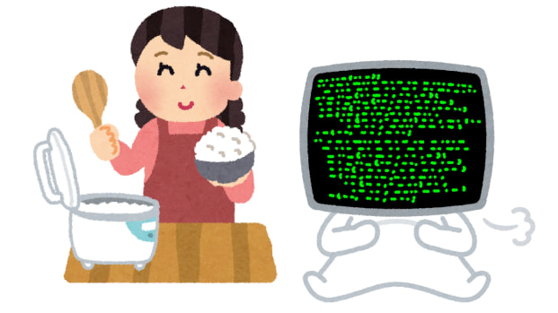
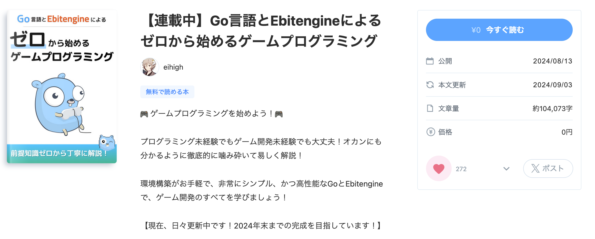
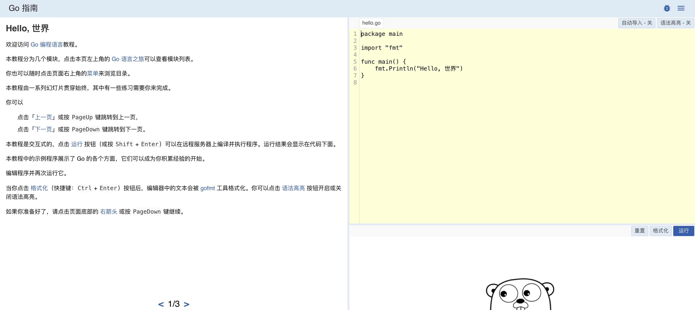
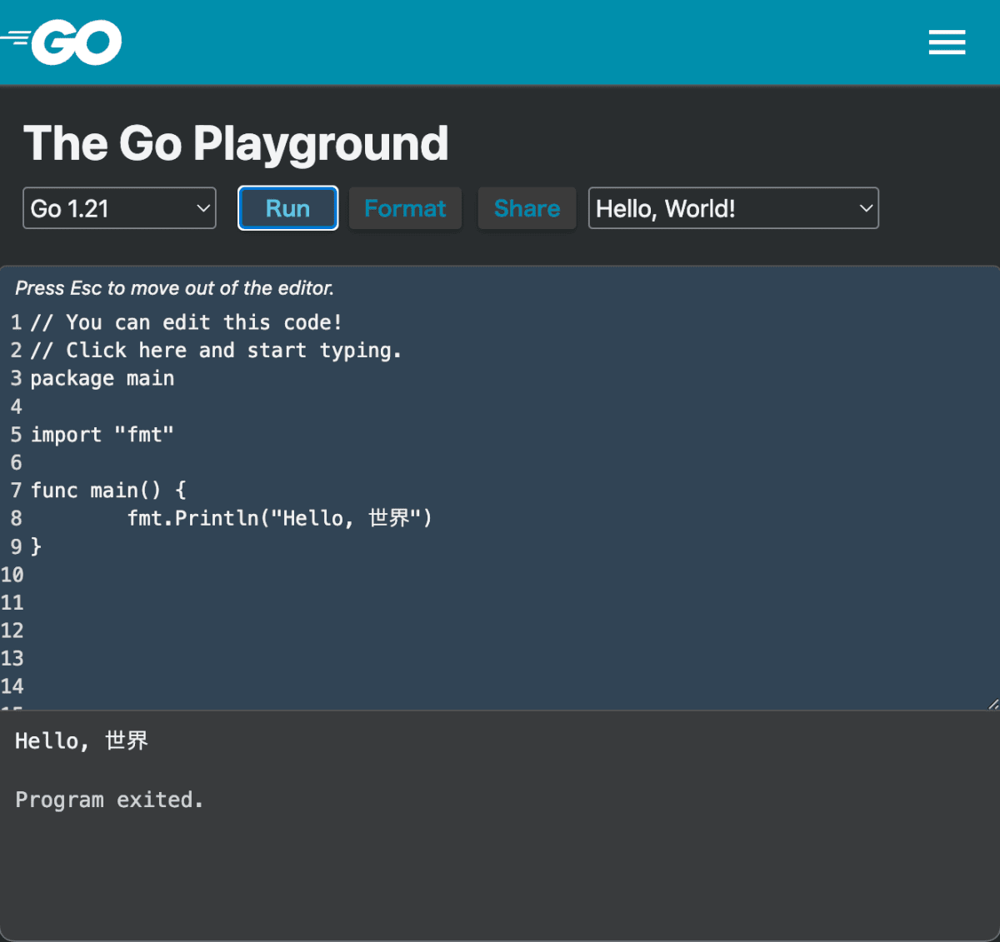
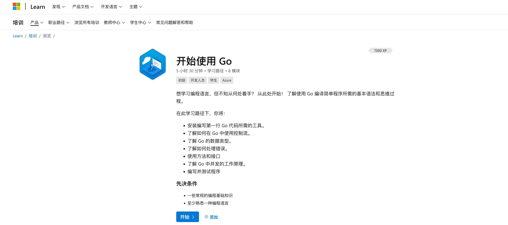
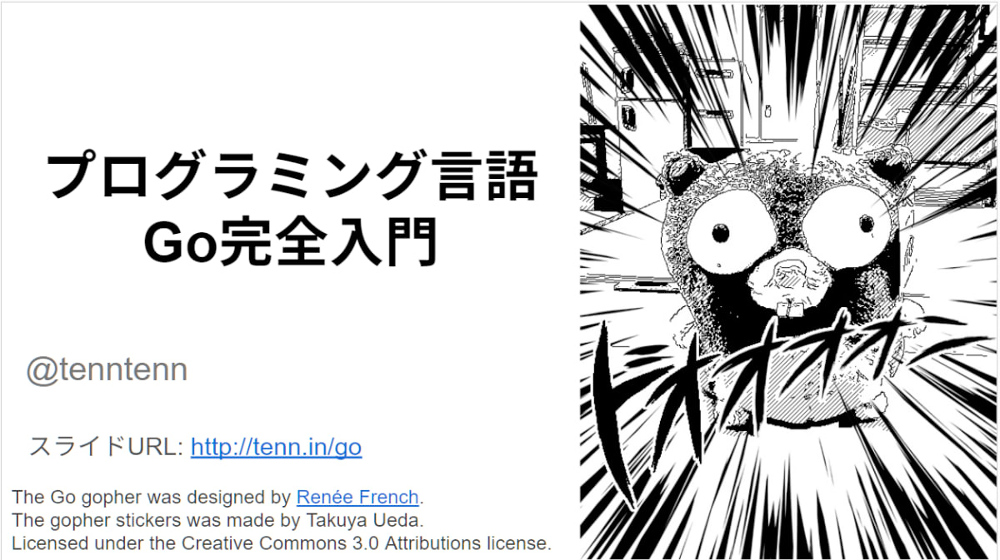
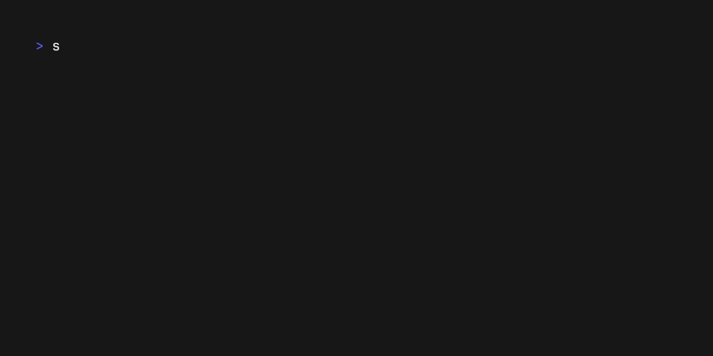
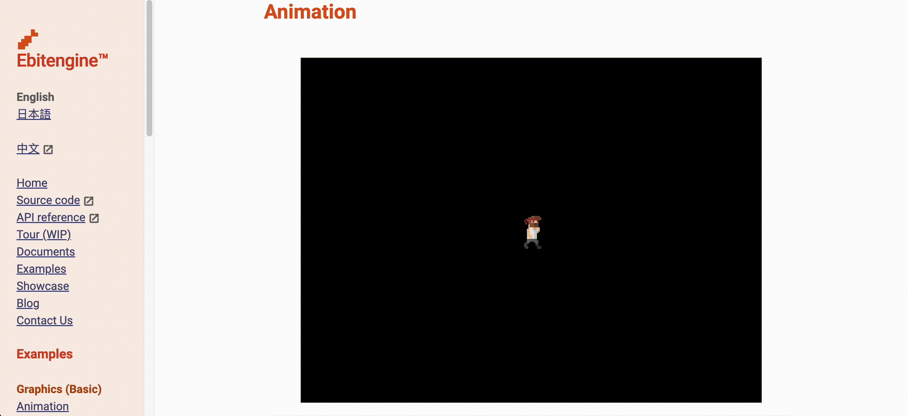

# 第一章 关于这本书

## 1.1 引言  
欢迎来到《从零开始的游戏编程：Go 语言与 Ebitengine》。   

本书旨在为完全没有编程经验的超初学者提供指导，以“连老妈都能理解”为目标，循序渐进讲解如何从零开始制作游戏。

希望通过本书，让你体会到游戏编程的乐趣。在这本书中，我们将最快的路线，从编程基础走到游戏开发。

· 极其易懂、细致解说如何配置编程环境  
· 一边让画面动，一边学习编程  
· 学习制作各种类型的游戏，都能用到的泛用技术  

以上就是我们的目标。如果读者里面有：

· 环境构建太难搞，总是半途而废   
· 黑窗口好无聊，啥时候才能有画面   
· 我学的东西，真的对制作游戏有帮助吗   

如果你这样想，恭喜，这本书正好适合你。另外本书还推荐给那些“游戏引擎很卡，在我的破电脑上跑不起来”的人。    

笔者入门游戏编程，用的是名为 BASIC 的古老编程语言。尽管 BASIC 仍然是一种伟大的语言，但与现代游戏开发相距甚远。 

在现代，能够实现前面这些这些宏伟目标的东西，笔者认为除了本书中提到的 Go 语言和 Ebitengine，可以说别无他选。   

如果有人因此立志用 Go 和 Ebitengine 制作游戏，对我来说将是无上的喜悦。但即使不是这样（也就是说，用其他引擎做游戏或最终没做游戏方面的编程），我也相信在这里学到的知识，一定会对你有所帮助。 

我虽然说了很多，但如果您能当作轻松的业余消遣来读，相信也一定会很有趣😉

## 1.2 这本书的使用方法  

这本书不仅可以在 PC 上阅读，也可以在手机上阅读。不过，实际编程需要用 Windows PC 或 Mac。

中文版托管在  [github.io](https://yumenaka.github.io/ebitengine-book-cn/) 上。中文版翻译校对完成后，也会有 Epub版 与 PDF版。

[（日文原版）](https://zenn.dev/eihigh/books/ebitengine-book/viewer/intro)虽然没有 Zenn 的账户也可以阅读，但如果登录 Zenn 账户，则会有阅读进度记录等功能，因此推荐注册。

代码确认是在 Windows 10、Windows 11 和 macOS Ventura 上进行的。如果有任何问题，请在以下社群中告知我们。

## 1.3 关于编程社群
您可以在 [Ebitengine 官方 Discord 服务器](https://discord.gg/3tVdM5H8cC)的 #questions-ja 频道中，直接向作者 @eihigh 询问。
任何小问题都非常欢迎！     

此外，我们还不定期举办轻松的学习交流会“Ebitengine ぷちConf”，最近的一次在 8 月 30 日举行。  
详情请[点击这里](https://gocon.connpass.com/event/322222/)。欢迎初学者参加，请随时加入我们！

## 1.4 请您给予支持 
全编免费阅读，但如果您从[（日文版）书籍目录画面](https://zenn.dev/eihigh/books/ebitengine-book)下方的“徽章（バッジ）”处给作者打赏，作者会非常高兴！  

## 1.5 其他学习资料  
学习 Go 语言的资料，除了这本书之外还有很多选择。以下是其中的一部分，希望对您有所帮助。

### GO指南

[A Tour of Go](https://tour.go-zh.org/welcome/1)  是 Go 官方提供的学习内容（链接是志愿者翻译的中文版）。
它的特点，是提供了 Go Playground 功能（后面会介绍），一边在左侧阅读文字版解说，一边在右侧编写实际的Go程序，并在浏览器上即时运行。
虽然教程的内容，假定读者有一定的编程经验，但依然是快速掌握 Go 的绝佳选择。

### Go Playground  
Go Playground 是 Go 官方提供的代码执行环境。可以在浏览器上编写并执行 Go 程序。或通过 Share 按钮发布 URL，共享编写的 Go 代码片段。  

不过由于 Go Playground 上运行的程序无法响应用户输入，因此不适合做游戏。适合快速检查语法、共享代码片段。
  

### 《开始使用 Go》微软出品的Golang 教程

虽然 Golang 是谷歌的产品，但却没有妨碍微软为Go写名为[《开始使用 Go》](https://learn.microsoft.com/zh-cn/training/paths/go-first-steps/)的在线教程。

这个教程，支持包括中文在内的大多数语言。特定章节，还能切换对应Windows、Linux、MacOS的版本。毕竟很多人也在使用微软 Azure 云 部署 Go 服务。培养 Go 开发者，是个互利互惠的好主意。

### 《Go语言编程 完全入门》（日语资料）  
[《Go语言编程 完全入门》（链接为日文版的谷歌Doc）](https://docs.google.com/presentation/d/1RVx8oeIMAWxbB7ZP2IcgZXnbZokjCmTUca-AbIpORGk/edit#slide=id.g4f417182ce_0_0)是由致力于 Go 普及的 tenntenn 先生编写的系列教程。
内容面向初学者，并且附有实际动手学习的实践环节，非常易于理解，推荐阅读。  

## 1.6 学习时的注意事项
因为 Go 始终在不断发展，某些教程可能因为信息过时而导致“照着做却不成功！”。这本书也不例外，所以请尽量参考最新信息。  

## 1.7 编程是什么，游戏编程是什么 
程序究竟是什么？我将尝试以老妈也能理解的方式解释。   

程序是指示计算机做事的工具。例如，编写指示计算机“按顺序显示 1 到 10 的数字”的程序，计算机就会按顺序显示 1 到 10 的数字。   
  
个人电脑、智能手机、游戏机等，所有计算机都由程序控制。如果没有程序，计算机就只是一个空壳。  

游戏编程，就是在编写作为游戏运行的程序。将图像显示在屏幕上、发出声音、对输入作出反应、移动角色等，这些都由程序控制与运行。  

此外，游戏编程的范围，不限于我们手头的电脑、手机和游戏机上运行的程序。

互联网某处的“游戏服务器”、为游戏开发者提供的“辅助工具”、以及被各种游戏使用、支撑开发的“游戏引擎”等等，游戏编程涉及多个领域，在这里我们不扩展讨论了。  

不过，现代游戏中这些内容也是不可或缺的，因此有意将游戏编程作为职业的人，建议您保持好奇心并积极学习。  

在这个连载中，我们将从零开始学习游戏编程。请务必体验一下从无到有，写出一款游戏的感觉。

## 1.8 Go 语言与 Ebitengine 概述

在本连载中，我将简要介绍将要使用的技术。对技术话题感兴趣的读者可以阅读一下。  

Go 语言是 2009 年正式发布的相对年轻的编程语言。语法简单、环境搭建轻松。具有脚本语言一样容易执行这样的“易用性”，与可以快速编译与执行速度快这样的“高性能”等特点。  

这种语言，还因由 C 语言的发源地[贝尔实验室](https://zh.wikipedia.org/wiki/%E8%B4%9D%E5%B0%94%E5%AE%9E%E9%AA%8C%E5%AE%A4)的资深程序员开发而闻名，Go 语言一方面保留了 C 语言的特征，也在吸取 C 语言的经验和教训的基础上，去除了复杂性，是现代化的编程语言。      

Go 主要用于 Web 与云服务领域，但 Go 当然也可以制作游戏。在这里，我们将使用 Go 加 Ebitengine 这个库（库：为了让大家分享，而编写的通用游戏组件）来制作游戏。   

Ebitengine（エビテンジン）是由日本人星一（Hajime Hoshi）开发的一个用 Go 开发游戏的库。    

它支撑了许多著名的作品，如[《梅格与怪物》](https://store.steampowered.com/app/1783360/_/)、[《熊先生的餐厅》](https://store.steampowered.com/app/1687550/_/)，以及备受期待的新作[《SAEKO: Giantess Dating Sim》](https://store.steampowered.com/app/2492120/SAEKO_Giantess_Dating_Sim/)。
游戏引擎与 Go 有很多共通之处，比如简单易用，运行速度快。

Ebitengine 另一个值得大书特书的特点，就是其支持平台范围广了。  

它不仅支持 Windows、macOS、Linux 等桌面环境，还支持使用WebGL在 Web 浏览器上运行 ，以及发布成为 iOS 和 Android 上的智能手机应用，甚至还能移植到 Nintendo Switch 和 Xbox 这些主机上。

它让用 Go 语言编写的游戏，可以轻松移植到各种平台。      

Ebitengine 官方网站上发布了[大量游戏示例](https://ebitengine.org/ja/examples/)，在浏览器上展示了游戏的的效果，代码可以直接复制粘贴运行。如果您有编程经验，可能只需浏览一遍示例就能掌握用法。请务必查看。

Ebitengine 是专注于 2D 游戏的引擎。 

虽然不支持 3D（因此用起来简单），但也有像 [Tetra3D](https://github.com/SolarLune/tetra3d) 这样基于 Ebitengine 的黑科技 3D 引擎，感兴趣的话可以去看看。

## 1.9 许可证
Go gopher（GO吉祥物地鼠）图片，采用创意共享 4.0 署名许可。阅读本文，以获取更多详细信息：[https://blog.golang.org/gopher ](https://blog.golang.org/gopher  )     

本教程用了 Egon Elbre 氏提供的 gopher 图像（ [https://github.com/egonelbre/gophers](https://github.com/egonelbre/gophers) ），该图像以 CC0 1.0 Universal 许可提供。

本书的原始图像可以在个人学习范围内自由使用。 

## 1.10 关于中文翻译
本书在[原作者eihigh](https://zenn.dev/eihigh)的许可下翻译，译文同样限定在个人学习范围内自由使用（也就是非商用）。  
为了便于中文读者理解，译文中添加了一些段落，替换了部分截图，不完全与原文一致。
