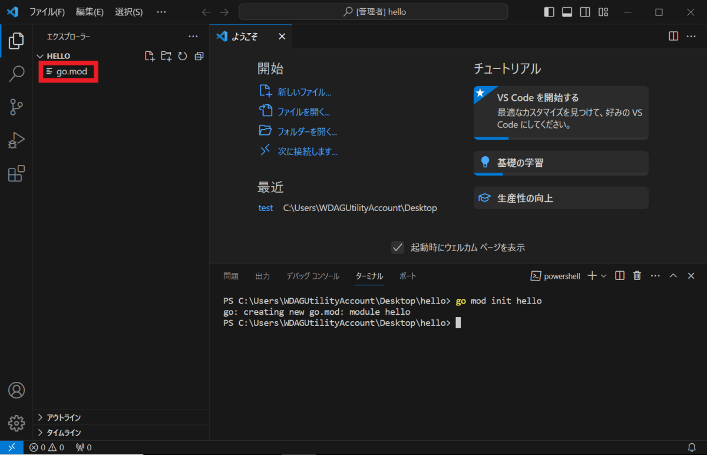
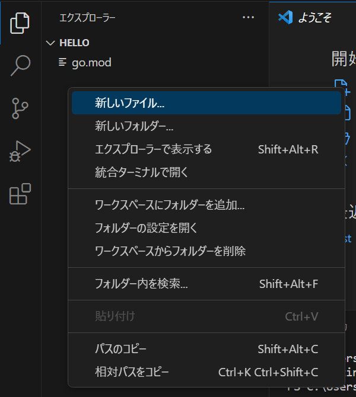
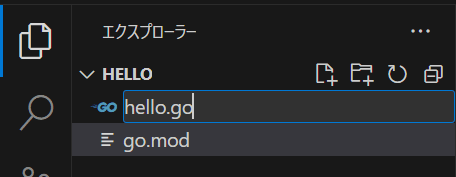
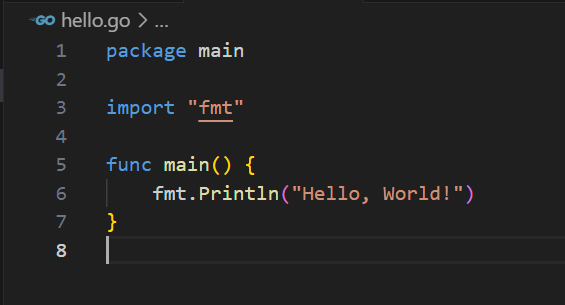
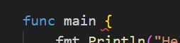
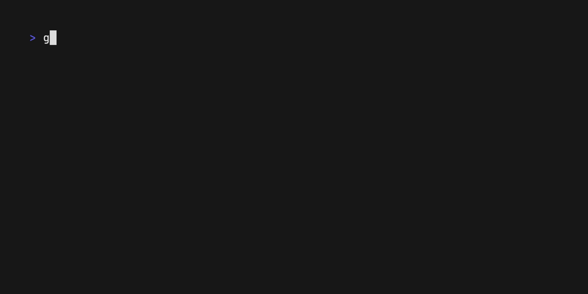
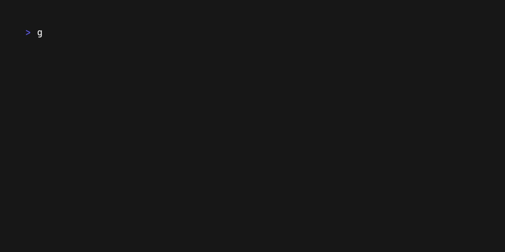
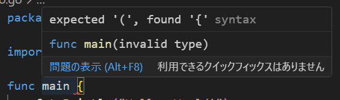
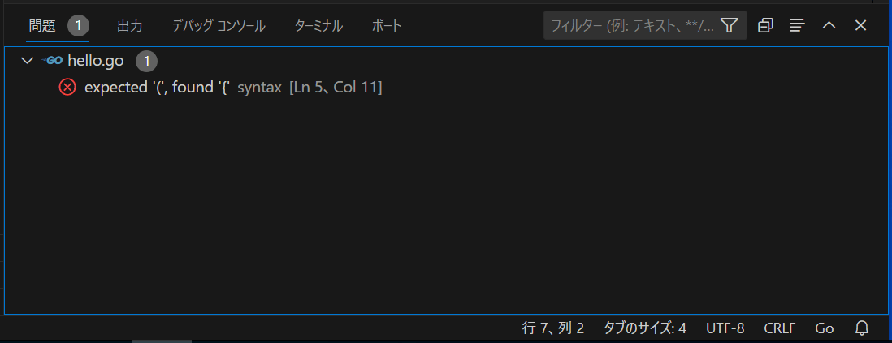

# 第三章 你好，世界！（开始开发，程序结构）

这次我们将通过一个仅显示 Hello, World! 的经典程序，学习如何开始编程，以及编程的基本工作流程。

## 3.1 程序与源代码

人们有时会特地强调文本特性，将生成程序的文本，称为“源代码”或“代码”。这些术语，基本上指的是同一个东西，请根据需要在脑中替换。

## 3.2 创建放程序的地方

首先，需要一个编写程序的地方。

让我们来创建一个新的目录。名字随便起，但这一章暂时用 hello 当名字。


创建目录后，在 VSCode 中打开它。

## 3.3 初始化模块

打开目录后，接下来需要初始化模块。关于模块的细节，稍后会进行说明，请打开终端并输入以下命令。

```Bash
go mod init hello
```

如果在资源管理器中生成了名为 go.mod 的文件（红框），则模块初始化成功。  
如果不成功，可能是命令敲错了、Go 安装失败，或当前目录与 VSCode 打开的目录不同。



## 3.4 编写程序

好了，现在我们有了放程序的地方。  
接下来创建文件。方法可以有很多，但在这里，我们选择在 VSCode 的资源管理器上空白处右键点击，然后点击“新建文件...”来创建。



接下来会要求输入文件名，这里输入 hello.go ，并按下回车键确认。   

.go 部分称为扩展名，是标识文件类型的重要部分。正确输入扩展名后，文件左侧的图标也会变成看起来像 “GO” 的图标。



在创建的文件中输入以下文本。如果觉得麻烦，可以直接复制粘贴下面的内容。另外，像往常一样，请**确保输入法为半角状态**。
```Go
package main

import "fmt"

func main() {
	fmt.Println("Hello World!")
}
```
输入后，按“Ctrl+s”保存。这样就写好了第一个程序。



如果下图所示的红色波浪线（在这里位于 { 的前面）显示出来，则表示该位置存在错误。如何处理错误，将在后面的章节说明，请再次确认输入的程序是否正确。



## 3.4 运行程序

现在执行程序。请在终端中输入以下命令。
```Bash
go run .
```
go run 是执行程序的 Go 命令， . 的意思是当前目录。合并后，意思是“执行当前目录的程序！”  

执行命令后，如果终端输出 `Hello, World!` 则表示运行成功。恭喜您！🎉

前回说明的那样，如果想要多次执行相同的命令，可以依次按下“上箭头、回车”。

## 3.5 编辑代码

如果程序顺利执行，那么这次我们尝试将程序修改为显示另一种语言。我们将用以下内容，改写之前写的程序。

```go
package main

import "fmt"

func main() {
	fmt.Println("跨越长城，走向世界！")
}
```

修改的是 `hello world！` 的部分。

*构成程序的主要字符，必须是半角字符。但夹在 `""` 之间的部分（称为字符串）等可以使用全角字符。具体情况稍后说明。

使用 `go run .` 执行程序时，应该会显示如下内容：


成功显示文字了吗？  

如果做到的话，请尝试试着显示更多不同的消息吧。

## 3.6 处理错误

 “错误”  这个东西，将会长期陪伴你。编辑器报告错误，绝不是在责怪你。

它会温柔地教你错误的原因和修正方法，甚至比学校的老师更亲切。

在 VSCode 中查看错误信息的方法：

- 在红色波浪线下方，用鼠标光标悬停时，会出现“悬停窗口”。

- 编辑器底部状态栏，点击 `✕ 1 ⚠ 0` 的部分，可以显示“问题”标签。

总之，有很多手段可以查看错误信息。






这里的提示 `expected '(', found '{'` ，意思是“接下来应该是 `(`，但实际的符号确实 `{` ”。实际上，这是编辑器在告诉你在 `main` 后面应该接 `()` 。明白这一点，就可以修正这个问题。

英语提示，可能会让人感到害怕，但就算英语半生不熟，也可以连蒙带猜，弄懂大体上的内容。如果报错内容很复杂，也可以将错误信息完整地粘贴到 Google 中搜索，很可能会有人提供解决方案。  

如果仍然感到怵头，可以利用像 ChatGPT 这样的 AI，向他们提问，并附上错误的信息和程序的文本，如果仍然有不明白的地方，可以继续和AI对话，逐步分析错误的原因。  

“报错”并不是要责怪你做了坏事。**与其因为害怕出错而烦恼，不如先把想不通的部分写出来试试。**通过“出错”来学习，才是正确与高效的做法。

无论多么熟练的程序员，都很难一次写好想要的程序。只要是人，都需要依赖“犯错”来寻路。

（其实，对于熟练的程序员来说，“有错误却没提示”的情况更让人害怕。不骗你。）   

请不要害怕错误，让“错误提示”成为你的趁手工具。

### 明明没写错，为什么却一直提示有错？

尽管如此，有时由于错误检查程序的 bug 或其他原因，即使是正确的代码，也可能无端报错。  

这种情况下，从命令面板（快捷键 Ctrl+Shift+p）中选择 `Go: Restart Language Server` 通常可以解决问题。  

相反，如果这样做仍然无法解决，很可能是因为你漏看了程序中的某些问题。

## 3.7 基本的开发流程

到目前为止，我们已经掌握了基本的开发流程。这个流程在今后也不会改变。

- 首先创建目录，并初始化模块。

- 创建 .go 文件，编写程序。

- 编辑程序。

- 执行程序。

-  如果有报错，请阅读错误提示，并修正代码。

- 反复执行“编辑、执行和修正”的循环，完善程序。


## 3.8 理解程序

刚才我们通过复制粘贴，体验了一把写程序的过程。接下来，我们要了解程序的细节。不过很难解释清楚每一个细节，现在只需了解大致即可。

此外，今后也会时不时出现**“声明/declaration”**这个词。

简单来说，就是指创建某个东西，告诉电脑**“这里有一个名为〇〇的东西！内容是XXXX！”**的意思。

稍微有点难以解释或翻译呢……有个大致的印象就可以了。

```go
package main // 声明一个包

import "fmt" // 导入模块

func main() { // 函数声明
	fmt.Println("Hello World!") // 调用函数
}
```

`package main` 表示该程序属于 `main` 包。

包是将程序捆绑在一起的单位，位于同一目录中的程序，基本上属于同一包。

`import "fmt"` 是用于导入其他包功能的导入语句。 `fmt` 包提供了在屏幕上显示文本的 `Println` 等函数。

`func main() {` 到 `}` 是 `main` 函数的声明。函数是指某些处理的集合。

`main` 包的 `main` 函数，是一个特殊的函数，表示程序的起点。可以认为在 `go run .` 中执行的处理，就是去运行这个 `main` 函数。

你可以试着将包名（package main）或函数名（func main() ）中的任意一个从 `main` 改为其他的名字，再次运行 `go run .`时应该会提示错误，无法正常执行。  

突然出现了很多新术语，相关细节稍后解释，现在只需了解“**原来有这样的东西”**就可以了。

## 3.9 程序注释

`//` 到行末的部分，是程序中不被识别的注释（或者说“备注”）。注释内容也可以使用全角字符。 

虽然无论有没有注释，都不会影响程序的执行。但清晰的注释，可以使程序（对人来讲）更易读。

使用 `/* */` 可以写多行注释（块注释）。与 `//` 相比，使用的机会较少，但偶尔还是会用到。  

```go
这不是注释 // 这是单行注释
这也不是注释

/*
多行注释
不止一行
也叫做“块注释”
*/

// 在 GO 程序里面
// 很多人习惯
// 用好几行单行注释
// 来代替多行注释
// （仅是个人感想）
```

评论具有“不影响程序执行”的特性，还可以作为“文档”或“指示”，用于除注释以外的目的，。这种注释的用法，将在合适的时候说明。

## 本章总结

- 在 Go 中创建新程序，需要创建目录并初始化模块。
- 「编写代码，用 `go run .` 上运行，修正代码」是基本的编程流程。
- 错误是和蔼的老师，值得尊敬与感激。如果搞不明白，可以求助 AI。
