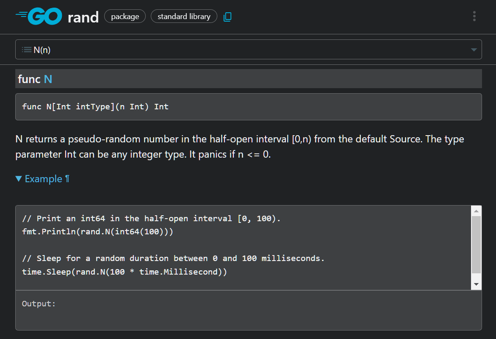

# 第五章 显示随机数（包与导入）


这次，我们将通过一个显示随机数的程序，学习为了使用 Go 丰富多彩的功能、必须掌握的“**包与导入**”两个概念。

## 5.1 显示随机数

以下的程序，可以显示从 0 到 5 的随机数。

```go
package main

import (
    "fmt"
    "math/rand/v2"
)

func main() {
    fmt.Println(rand.N(6))
}
```

 结果每次都不同，以下是一个运行程序的例子。

```
$ go run .
3
$ go run .
0
```


重点：在 Go 等语言中，数列通常从 0 开始。例如， `rand.N(3)` 会随机返回 0、1、2 这三种数字中的一个。这种计数方式在日常生活中不太常见，但在编程中实际上更为方便。

### [面向有经验的人]  随机种子

Go 的 math/rand/v2 包的全局函数生成的随机数，每次都不一样（随机化）。这是因为这样在安全性上更为可取。

但在游戏中，固定随机数的种子值，以实现“可再现性”是常见的做法。例如，可以通过仅保存种子值，而不是所有数值来重现世界。比如在《我的世界》中，通过相同的种子值，可以让玩家游玩同一世界，甚至像著名的《德鲁亚加之塔》，也有将随机种子融入游戏设计中的美谈。

在 Go 中生成种子固定随机值的方法，是将种子值传递给 [rand.NewPCG 函数](https://pkg.go.dev/math/rand/v2#NewPCG)或 [rand.NewChaCha8 函数](https://pkg.go.dev/math/rand/v2#NewChaCha8)，以创建随机数生成器。

## 5.2 包和导入语句

包是将 Go 程序捆绑在一起的单位。此外，通过导入，可以引入其他包的功能。


下面这个程序，导入了 `fmt` 包和 `math/rand/v2` 包。 `math/rand/v2` 包是处理随机数和随机数的包。

```go
import (
    "fmt"
    "math/rand/v2"
)
```

上面的两个包被 `()` 起来。在语法上，上面的代码，与下面这两行导入语句的意思相同。

```go
import "fmt"
import "math/rand/v2"
```

## 5.3 导入路径和包名

导入语句中写的字符串，被称为导入路径。

导入路径是指示包的位置的东西。 `"fmt"` 和 `"math/rand/v2"` 就是其中的例子。 
在程序中使用包的功能，需要在包名后加上点 `.` ，像 `fmt.` 和 `rand.` 这样写。 
有像 `fmt` 这样，导入路径（最后一个单词）和包名相同的例子。但也有像 `math/rand/v2` 和 `rand` 那样，包名与路径稍微不同的时候。

这方面没有严格的规范，所以让我们随意一点吧。

## 5.4 查看文档

全世界的公开 Go 包的文档都汇集在 [pkg.go.dev](https://pkg.go.dev) 这个网站上。对于使用 Go 编程的人来说，这是必不可少的工具。因此如果未来想找未知的包，请务必参考。
不过，这些包的说明，大多数是用英文写的。因此建议使用浏览器的扩展功能翻译阅读。

 
上图是 [rand.N 函数的文档](https://pkg.go.dev/math/rand/v2#N)。有的包，可能会附带示例程序。

### [面向有经验的人] 导入路径和包名、模块的详细信息

如果导入路径以 `github.com/` 等域名开头，那么这个包将从互联网上获取。

如果不是，该包是 Go 的标准包，将从 GOROOT（Go 的安装位置，可以用 `go env GOROOT` 这个命令确认）的 src 目录下获取。

导入路径以斜杠分隔的最后一个元素通常是包名，但这个规则并不是绝对的。

- 以 `/v2` 结尾的包表示版本 2。主版本变化，意味着新版本不兼容旧版本，因此 Go 建议通过**更改导入路径（这里就是加了一个/v2）**来区分版本。
- 也有像 `github.com/mattn/go-sqlite3` （此包的包名是 `sqlite3` ）这样，包名与路径不一致的情况。根据作者的需要，可以自定义导入路径和包名。

##  本章总结

- 通过使用**软件包**，可以使用各种功能。
- 要使用包，首先需要指定导入路径（ `math/rand/v2` 等）并进行**导入**。
- 使用**包名**（ `rand` 等）调用包的功能。
