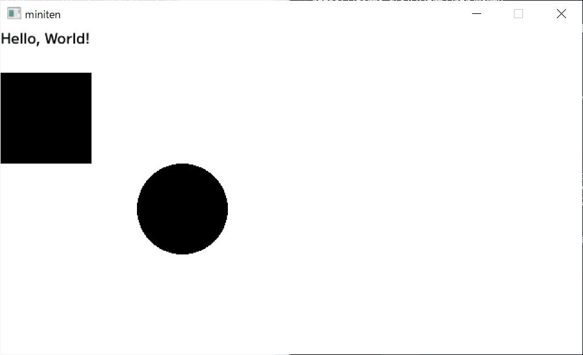

# 第八章 绘制窗口

在终端运行的纯文字程序也差不多让人厌了。这次终于要显示图形了。

## 8.1 掌握 Ebitengine 以前


因此，我想立即使用 [Ebitengine……](https://ebitengine.org/ja/)  

但我还没有教完使用 Ebitengine 所需的前提知识。因此，我们先使用作者精心制作的（精简版Ebitengine） [miniten 包](https://pkg.go.dev/github.com/eihigh/miniten)，学习制作一款游戏。


这是一个弹出窗口，并显示“Hello, World!”的程序。

```go
package main

import "github.com/eihigh/miniten"

func main() {
	miniten.Run(draw)
}

func draw() {
	miniten.Println("Hello, World!")
}
```

那么我们就马上来执行一下吧。

```
$ go run .
main.go:3:8: no required module provides package github.com/eihigh/miniten; to add it:
        go get github.com/eihigh/miniten
```


哦...出错了。当使用像 miniten 这样的外部新包时，如果该信息未记录在 `go.mod` 文件中，就会出现错误。请执行 `go mod tidy` 命令，以更新 `go.mod` 文件。

```
$ go mod tidy
...应该会看到一些log文字...
```

稍等一下，顺利结束后，再次执行吧。第一次运行，可能会多花一点时间。

```
$ go run .
```

窗口左上角显示“Hello, World!”就可以了！🎉


有其他语言经验的人，Go 从互联网上的下载第三方包的步骤，可能简单到令人感动。作者第一次看到的时候，确实也很感动。

## 8.2 绘制图形

那么就按照这个节奏，画矩形和圆吧。稍后会解释为什么，但绘制必须在 `draw` 函数内进行。

```go
func main() {
	miniten.Run(draw)
}

func draw() {
	miniten.Println("Hello, World!")
	miniten.DrawRect(0, 50, 100, 100) // 四个数，分别是矩形左上角坐标（0、50）、宽（100）、高（100）
	miniten.DrawCircle(200, 200, 50)  // 中心点的坐标（200、200）、圆的半径（50）
}
```



miniten 可以绘制的图形，只有矩形和圆形。其他图形和换颜色，要等到真正入门 Ebitengine 后再进行。

## 8.3 座标


这里所说的坐标，是“描述窗口内某个点”的值，由表示横向距离的“X”，和纵向距离的“Y”的组合表示。

- 窗口左上角是起点坐标，此处的X 为 `0` ，Y 为 `0` 。
- 从左上角向右移动，X 会增加；向下移动，Y 会增加。
- 刚才绘制的矩形，左上角的坐标是 `(0, 50)` ，也就是横向是窗口最左边，纵向是从窗口顶边下移 50 的位置。
- 刚才绘制的矩形，宽度和高度分别为 `100` ，因此矩形右下角的坐标为 `(0+100, 50+100) = (100, 150)` 。

学校里学习的坐标轴，往上走时 Y 值通常会增加。  

但游戏窗口的坐标，则是往下时 Y 值增加，与学校里常见的相反。  

就是这么规定的，只能习惯。

## 8.4 绘制图像


在 miniten 中可以绘制的图形只有这些，这确实有些无聊。不过请放心，您可以绘制喜欢的图像！

首先需要准备图像文件。什么图片都可以，但是为了懒得准备图像的你，这里准备了 Go 的吉祥物 gopher 君的图像。


```text
该设计采用创意共享 4.0 署名许可。
阅读本文以获取更多详细信息：https://blog.golang.org/gopher
```

请右键点击这个 gopher 君，选择“另存为图片”。并将保存的图片文件，移动到**与程序相同的目录**中。

这是绘制图像的程序。请根据你保存的图像文件名，调整 `"gopher.png"` 部分。同时也不要忘记添加正确的扩展名。

```go
func main() {
	miniten.Run(draw)
}

func draw() {
	miniten.DrawImage("gopher.png", 0, 0) // 图片文件名、左上角图标
}
```

图像如果显示在左上角，成功！🎉


如果显示不正常，请检查一下图片文件名是否正确、是否忘记加扩展名，以及是否放在与程序相同的目录中。

## 本章总结

- 在 miniten 中，绘制处理写在 draw 函数内。
- 绘制图像时，请将图像文件准备在同一目录中。不要忘记扩展名。
- 表示窗口某一点的位置的数字，被称为坐标。
