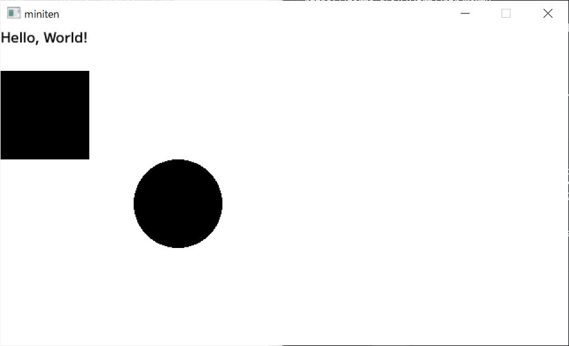
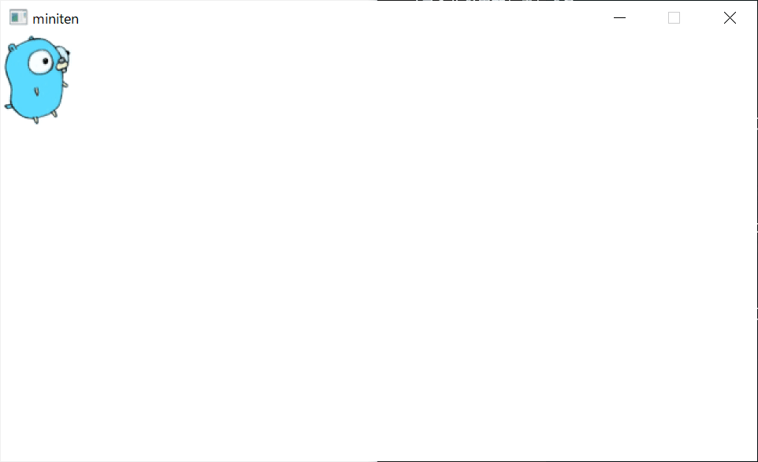

# 第八章 绘制窗口

在终端里运行的纯文字程序，也差不多让人厌了。这次终于要显示画面了。

## 8.1 掌握 Ebitengine 以前


接下来，我想立即使用 [Ebitengine……](https://ebitengine.org/ja/)  

可是，我还没有教完使用 Ebitengine 所需的前提知识。
于是，我们先使用作者精心制作的 [miniten 包](https://pkg.go.dev/github.com/eihigh/miniten) （精简版Ebitengine），学习制作一款游戏。


这是一个弹出窗口，并显示“Hello, World!”的程序。

```go
package main

import "github.com/eihigh/miniten"

func main() {
	miniten.Run(draw)
}

func draw() {
	miniten.Println("Hello, World!")
}
```

那么，我们马上来运行它吧。

```
$ go run .
main.go:3:8: no required module provides package github.com/eihigh/miniten; to add it:
        go get github.com/eihigh/miniten
```

哦...出错了。  

当使用像 miniten 这样的新的外部包时，如果该包信息未记录在 `go.mod` 文件中，就会出现错误。

请执行 `go mod tidy` 命令，以更新 `go.mod` 文件。

```
$ go mod tidy
...应该会看到一些log...
```

稍等一下，等命令执行完后，再次运行程序吧。

第一次运行，可能会多花一点时间。

```
$ go run .
```

如下图，看到窗口左上角显示“Hello, World!”就可以了！🎉


有其他语言经验的人，Go 从互联网上的下载第三方包的步骤，可能简单到令人感动。

作者第一次看到的时候，确实也很感动。

## 8.2 绘制图形

那么就按照现在的节奏，继续学习画矩形和圆吧。 

绘制必须在 `draw` 函数里面进行（稍后会解释理由）。

```go
func main() {
	miniten.Run(draw)
}

func draw() {
	miniten.Println("Hello, World!")
	miniten.DrawRect(0, 50, 100, 100) // 四个数，分别是矩形左上角坐标（0、50）、宽（100）、高（100）
	miniten.DrawCircle(200, 200, 50)  // 中心点的坐标（200、200）、圆的半径（50）
}
```



miniten 可以绘制的图形，只有矩形和圆形。

花其他形状或换颜色，要等到真正入门 Ebitengine 后再学习。

## 8.3 座标

这里所说的坐标，是“代表窗口内某点”的值。

由表示横向距离的“X”，和纵向距离的“Y”的成对表示。

- 窗口左上角是起点，此处的X 为 `0` ，Y 为 `0` 。
- 从左上角向右移动，X 增加；向下移动，Y 增加。
- 刚才绘制的矩形，左上角坐标是 `(0, 50)` ，也就是横向在窗口最左边，纵向是在窗口顶部下移 50 的位置。
- 刚才绘制的矩形，宽度和高度分别为 `100` ，因此矩形右下角的坐标是 `(0+100, 50+100) = (100, 150)` 。

学校里学习的坐标轴，往上走时 Y 值通常会增加。  

但游戏窗口的坐标，往下走的时候 Y 值增加，与学校里常见的相反。  

就是这么规定的，请习惯。

## 8.4 绘制图像

在 miniten 中，可以绘制的图形只有圆和矩形，可能会让你感到有些无聊。

不过请放心，在这里。您也可以加载使用喜欢的图片！

首先需要准备图像文件。什么图都可以，但是为了懒得准备图像的你，这里也准备了 Go 吉祥物 gopher 君的图片。


```text
该设计，采用创意共享 4.0 署名许可。
阅读本文以获取更多详细信息：https://blog.golang.org/gopher
```

请右键点击这个 gopher 君，选择“另存为图片”。并将保存的图片文件，移动到**与程序相同的目录**中。

这是绘制图像的程序。请根据你保存的图像文件名，调整 `"gopher.png"` 的文件名部分。同时也不要忘记添加正确的扩展名。

```go
func main() {
	miniten.Run(draw)
}

func draw() {
	miniten.DrawImage("gopher.png", 0, 0) // 图片文件名、左上角图标
}
```

如果图片显示在左上角，那就成功了！🎉



如果无法正常显示，请检查一下图片文件名是否正确、是否忘记加扩展名，以及是否放在与程序相同的目录中。

## 本章总结

- 在 miniten 中，绘图的处理，需要写在 draw 函数里面。
- 绘制图像时，请将图像文件放在同一目录。同时不要忘记确认扩展名。
- 表示窗口某点位置的数字，被称为坐标。
