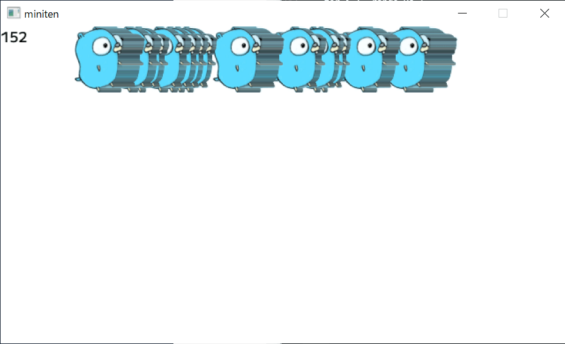

# 第十一章 加快动作（切片与循环）

上次我们学习了如何让角色自然地移动。然而，游戏中除了玩家角色，还需要许多敌人和物体。因此，我们需要一种管理多个对象的方法。

## 11.1 数组

 当我想移动很多东西时

```go
var x0 int
var x1 int
var x2 int
```

写很多变量很麻烦。几个变量还好，几千、几万个，手动写下来就不太可能了。这时一般使用数组/array……

但在 Go 中更常用的是切片/slice，不过为了方便说明，我先从数组开始讲解。  

数组是将任意数量的相同类型的变量排列在一起的结构。数组的每一个变量称为元素/element。数组的类型以 `[长度]元素类型` 的形式声明。例如

```go
var xs [3]int
```


如果这样写，就像刚才写的 `x0` `x1` `x2` 一样，程序中会造出来三个放在一起的` int`。

配列和切片，这种拥有多个相同元素的变量，英文名的后缀，通常会加上表示英语复数形式的 `s` 和 `es` 。比如 `xs` 是 `x` 的复数形式。

配列也可以在声明的同时赋值。表示数组的值，可以使用合成字面量/composite literal，以 `类型名称{值, 值, ...}` 的形式书写。

```go
var xs = [3]int{0, 100, 200}
// 上面的写法，与下面作用一样
var x0 = 0
var x1 = 100
var x2 = 200
```

配列的魅力，无疑在于索引/index。索引是元素编号、是从 0 开始的数字。这样，您可以通过 `变量名[索引]` 来访问每个元素。

```go
func main() {
	xs := [3]int{0, 100, 200}
	fmt.Println(xs[0]) // 索引为 0 的元素，存储的数字是 0
	fmt.Println(xs[1]) // 索引为 1 的元素，存储的数字是 100
}
```

索引是数字，因此可以写算式，也可以使用变量。连续定义多个变量，就没有这种方便的功能了。

```go
func main() {
	xs := [3]int{0, 100, 200}
	index := 1
	xs[index] = 99  // 用变量当索引
	fmt.Println(xs) // [0 99 200]
}
```

请注意，如果索引超过数组的长度或为负数，程序会崩溃，因此请小心。

```go
func main() {
	xs := [3]int{0, 100, 200}
	fmt.Println(xs[3])  // 程序崩溃
	fmt.Println(xs[-1]) // 程序崩溃
}
```

## 11.2 `for range`循环的另一种用法

配列和切片与 `for range` 语句结合使用时会更方便。    

之前教的是“指定重复次数，并获取当前次数”的 for range 语句。  

这次新学的是“顺序提取数组或切片的元素”的 for range 语句。  

```go
func main() {
	xs := [3]int{0, 100, 200}
	for i, v := range xs {
		fmt.Println(i, v)
	}
}
```

```bash
$ go run .
0 0
1 100
2 200
```

这个语法与指定回数的 for range 非常相似，但重复的次数是数组元素的数量，并且可以与循环次数 `i` 一起提取对应的元素 `v` 。这种类型的 for 语句非常常用。


如果不需要回数，只想提取元素，可以使用特殊的空白变量 `_` 来明确表示不用并丢弃这个参数。  

在 Go 中，如果定义了却没有使用某个变量，会导致程序报错，因此需要记住这一点。

```go
func main() {
	xs := [3]int{0, 100, 200}
	for _, v := range xs {
		fmt.Println(v)
	}
}
```


相反，如果只想提取次数，则只需使用一个变量来接收。

语法上就是这么规定的，习惯并记住就好。

```go
func main() {
	xs := [3]int{0, 100, 200}
	for i := range xs { // 这里没有定义 v，只接收循环次数
		fmt.Println(i)
	}
}
```

### 移动多个箱子

接下来，我们结合数组和 for，试着移动多个箱子。

```go
package main

import "github.com/eihigh/miniten"

var xs = [3]int{0, 100, 200} // 箱子的初始位置

func main() {
	miniten.Run(draw)
}

func draw() {
	for i := range xs { //  重复三次
		xs[i] += 1 // 向右移动箱子
	}
	for _, x := range xs { // 重复三次
		miniten.DrawRect(x, 0, 50, 50) // 描绘箱子
	}
}
```

这个程序将显示三个逐渐向右移动的箱子。

需要注意的地方可能是 `xs[i] += 1` 。以下的写法是错的。

```go
func draw() {
	for _, x := range xs {
		x += 1
	}
	for _, x := range xs {
		miniten.DrawRect(x, 0, 50, 50)
	}
}
```

 `for _, x := range xs` 取出的 `x` 是元素克隆后的副本，因此即使对副本加上 `x += 1` ，也不会影响原始数组 `xs` 。需要以 `xs[i] += 1` 的形式对原始数组进行赋值。这有点难，所以在今后巩固 Go 的基础时，逐渐理解就可以了。

## 11.3 切片

配列的类型 `[长度]` 部分是类型的一部分，此数字相当特殊，不能在这里使用变量。

```go
var length = 3
var xs = [length]int{0, 100, 200} // できない
```

此外，数组的长度是固定的，无法在后期扩展。实际上，Go 的数组并不是为了日常使用而设计的，大多数情况下，使用的是可以在后期扩展长度的**切片/slice**。

切片以 `[]元素类型` 的形式书写。其他部分基本与数组相同。

用切片重写刚才移动箱子的程序，可以看出，除了类型外完全相同，能够正常运行。

```go
package main

import "github.com/eihigh/miniten"

var xs = []int{0, 100, 200} // 把[3] 替换成 [] ，这里用的就不是数组，而是是切片了

func main() {
	miniten.Run(draw)
}

func draw() {
	for i := range xs {
		xs[i] += 1
	}
	for _, x := range xs {
		miniten.DrawRect(x, 0, 50, 50)
	}
}
```

###  append 函数

之前说的内容中提到，切片与数组不同，声明以后可以继续添加元素。使用 `append` 函数，可以在切片的末尾添加元素。

```go
func main() {
	xs := []int{}           // 做一个空切片
	xs = append(xs, 10)     // 添加一个元素
	xs = append(xs, 20, 30) // 添加多个个元素
	fmt.Println(xs)         // [10 20 30]
}
```

注意点是， `append` 函数会返回一个新的切片作为返回值，因此需要将其赋值给原始切片。

```go
xs = append(xs, 0) // OK
append(xs, 0)      // NG（不会改变原始切片的值）
```

###  len 函数

当您想知道该切片的当前长度时，可以使用 `len` 函数。

```go
func main() {
	xs := []int{0, 100, 200}
	fmt.Println(len(xs)) // 3
	xs = append(xs, 300)
	fmt.Println(len(xs)) // 4
}
```

### 玩玩看

该程序在点击期间添加 gopher。

```go
package main

import "github.com/eihigh/miniten"

var xs = []int{} // 初始状态下是空的，一个也没有

func main() {
	miniten.Run(draw)
}

func draw() {
	if miniten.IsClicked() {
		xs = append(xs, 0) // 每点击一次，就加一只地鼠
	}
	for i := range xs { // 循环“地鼠的数量”回
		xs[i] += 1
	}
	for _, x := range xs { // 循环“地鼠的数量”回
		miniten.DrawImage("gopher.png", x, 0)
	}
	miniten.Println(len(xs)) // 显示有几只地鼠
}
```

 *gopher大増殖*

### slices 包


追加以外，在 [slices 包](https://pkg.go.dev/slices)里面还有删除和排序等功能。虽然这是 go 的官方标准包，但意外地不为人知。在这里知道了这件事，就能凭知识与他人拉开差距。

### [面向有经验的人] 切片与数组的关系


切片的实体顾名思义，就是像切片奶酪一样，切割出来的数组的一部分或全部。在索引部分写上 `[开始:结束]` ，可以切出数组或切片。开始和结束标志是可选的，省略时，分别表示开头和结尾。

```go
a := [5]int{0, 1, 2, 3, 4}
s1 := a[:]    // [0 1 2 3 4]
s2 := s1[:3]  // [0 1 2]
s3 := s1[2:]  // [2 3 4]
s4 := s1[1:4] // [1 2 3]
```

切片背后总是有一个数组。即使直接写 `xs := []int{0, 1, 2}` 来创建切片也是一样。背后会自动创建一个数组。
此外， `append` 函数在超出其背后数组的长度时，会重新创建一个更大的数组并复制元素。因此，如果知道切片的长度，使用 `make` 函数进行初始化，就可以避免切片的重新分配，从而提高程序运行速度。

```go
// 虽然切片本体长度是0，但是后台因旱地创造了一个长度为100的数组
xs := make([]int, 0, 100)
```

后台数组的大小可以通过 `cap` 函数获取。观察 append 如何改变 cap 会很有趣。

```go
func main() {
	xs := []int{}
	for range 100 {
		xs = append(xs, 0)
		fmt.Println(len(xs), cap(xs))
	}
}
```

```bash
$ go run .
1 1
2 2
3 4
4 4
5 8
6 8
...中略...
97 128
98 128
99 128
100 128
```

在这一点上，几乎可以不必太在意，单纯地认为“切片很方便”使用也没有问题，但如果能够正确使用 `make` 函数，Go 的性能问题大约有 80% 可以解决（主观感想），所以掌握你会变得更强。

## 本章总结


这次内容很丰富，我们来总结一下好好复习吧。

- 切片将多个元素排列在一起。与数组不同，切片可以在后面添加元素
- 声明切片的语法，是 `[]元素类型` 
- 可以写为 `[]元素类型{元素, 元素, ...}` 的形式
- 取出元素的语法是 变量名[索引]`
-  使用`for 回数, 元素 := range 切片 { ... }` 这个语法，可以顺序提取切片的元素
-  `append` 函数可以给切片添加元素
-  `len` 函数可以获取切片的长度
- 可以使用 [slices 包](https://pkg.go.dev/slices)进行其他切片操作
