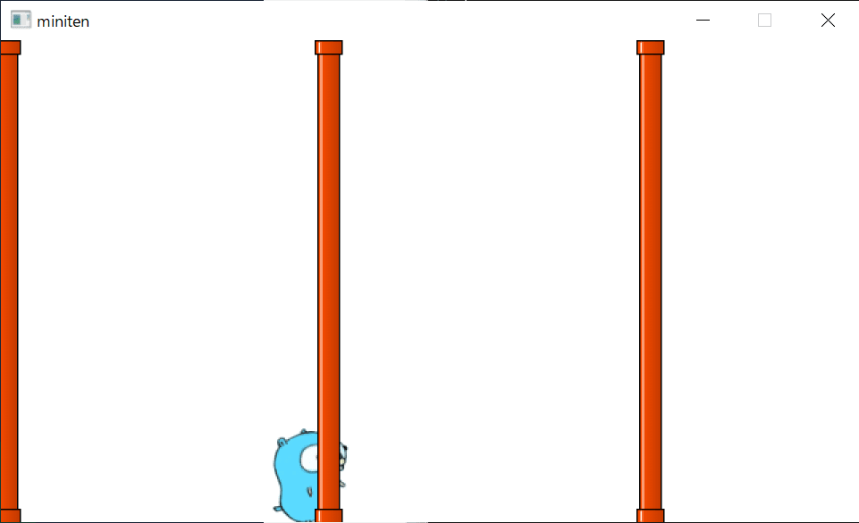

# 第十二章 飞天地鼠游戏 （1）会动的土管

前一章我们学习了角色移动、管理数据等很多内容。这次我们终于要开始制作游戏了。

##  制作飞天地鼠游戏

这次制作的是 Ebitengine 的示例游戏中也包含的，flappy xxxx 游戏。游戏的内容是

-  点击后，gopher 君会跳跃。
- 右侧的有缺口的土管不断靠近，玩家要巧妙地穿过洞。
- 尽量长时间不碰壁、生存下去。

就是这么简单。让我们开始制作吧。

##  做跳跃的 gopher 

首先，我们来创建玩家角色。这与之前写的程序几乎相同，但为了便于后续调整，我们将 X 坐标和跳跃力设置为变量。从现在开始，程序中的数字尽量使用变量。

```go
package main

import (
	"github.com/eihigh/miniten"
)

var (
	x    = 200.0
	y    = 150.0
	vy   = 0.0  // Y方向速度(Velocity of y)的缩写
	g    = 0.1  // 重力加速度(Gravity) 的略称
	jump = -4.0 // 跳跃力
)

func main() {
	miniten.Run(draw)
}

func draw() {
	if miniten.IsClicked() {
		vy = jump
	}
	vy += g // 当前速度 = 速度+加速度
	y += vy // 当前位置 = 位置+速度
	miniten.DrawImage("gopher.png", int(x), int(y))
}
```

##  迫近的土管

接下来我们将创建土管。作为土管的图像，我们准备了这个 `wall.png` ，请像 gopher 君时一样右键点击“另存为图片”，并将其放置在与程序相同的目录中。


让我们编写一个不断逼近的土管。重点是“每隔一定时间添加一堵土管”。

来自前一个程序的更改部分为绿色（TODO）。

在 Go 中，由多个英语单词组成的名称通常使用大写字母分隔，这被称为驼峰命名法。例如 `wallXs` 是 `wall` 和 `xs` 的合成。

```diff-go
package main

import (
	"github.com/eihigh/miniten"
)

var (
	x    = 200.0
	y    = 150.0
	vy   = 0.0  // Y方向速度(Velocity of y)的缩写
	g    = 0.1  // 重力加速度(Gravity) 的缩写
	jump = -4.0 // 跳跃力

	frames     = 0       // 经过的帧总数
	interval   = 120     // 土管的追加间隔
	wallStartX = 640     // 土管的初始化x坐标
	wallXs     = []int{} // 土管的x坐标
	wallWidth  = 20      // 土管的宽度
	wallHeight = 360     // 土管的高度
)

func main() {
	miniten.Run(draw)
}

func draw() {
	if miniten.IsClicked() {
		vy = jump
	}
	vy += g // 新的当前速度 = 当前速度+加速度
	y += vy // 新的当前位置 = 当前位置+速度
	miniten.DrawImage("gopher.png", int(x), int(y))

	// 从这里开始，写追加土管壁的代码
	frames += 1
	if frames%interval == 0 {
		wallXs = append(wallXs, wallStartX)
	}
	// 追加土管壁的代码， 到这里就结束了

	for i := range wallXs {
		wallXs[i] -= 2 // 往左动
	}
	for _, wallX := range wallXs {
		miniten.DrawImage("wall.png", wallX, 0)
	}
}
```

起动后大约 2 秒钟，如果能看到土管从右向左逼近就可以了。



 `frames%interval == 0` 的部分是关键。 `%` 是求余数的符号。余数的特点是会产生如下的周期性。

```
原始数字:		0 1 2 3 | 4 5 6 7 | 8 9 10 11 | 12 ...
除4的余数:	0 1 2 3 | 0 1 2 3 | 0 1  2  3 |  0 ...
```


这个性质非常适合“定期做某事”。 `frames%120 == 0` 意味着“每 120 帧做某事”。

draw 函数被调用的频率会因您使用的显示器而有所不同，因此请根据需要调整间隔和速度。

##  打孔


这次制作的土管从上到下完全封闭。我们来打个洞。打洞的方法有几种，这里我们就这样做。

- 上面的土管和下面的土管，分开考虑。

- 穴的上端 Y 坐标（ `holeY` ）随机确定。
  
-  上面的土管，需要比 `holeY` 高。

  - 上面的土管的底部，与孔的顶部对齐。
  -  上面的土管的顶部是 `holeY - wallHeight` 。
  
- 下面的土管，将从 `holeY` 向下移动一个孔的位置开始绘制。

  - 下的土管的顶部坐标是 `holeY + holeHeight` 。


```diff-go
package main

import (
	"math/rand/v2"

	"github.com/eihigh/miniten"
)

var (
	x    = 200.0
	y    = 150.0
	vy   = 0.0  // Y方向速度(Velocity of y)的缩写
	g    = 0.1  // 重力加速度(Gravity) 的缩写
	jump = -4.0 // 跳跃力

	frames     = 0       // 经过的帧总数
	interval   = 120     // 土管的追加间隔
	wallStartX = 640     // 土管的初始化x坐标
	wallXs     = []int{} // 土管的x坐标
	wallWidth  = 20      // 土管的宽度
	wallHeight = 360     // 土管的高度
	holeYs     = []int{} // 洞的 Y 坐标
	holeYMax   = 150     // 洞的 Y 坐标的最大值
	holeHeight = 170     // 洞的大小（高度）
)

func main() {
	miniten.Run(draw)
}

func draw() {
	if miniten.IsClicked() {
		vy = jump
	}
	vy += g // 新的当前速度 = 当前速度+加速度
	y += vy // 新的当前位置 = 当前位置+速度
	miniten.DrawImage("gopher.png", int(x), int(y))

	//  土管相关的处理
	frames += 1
	if frames%interval == 0 {
		wallXs = append(wallXs, wallStartX)
		holeYs = append(holeYs, rand.N(holeYMax))
	}
	// 土管相关的处理结束

	for i := range wallXs {
		wallXs[i] -= 2 //  往左动
	}
	for i := range wallXs {
		// 描绘上方的土管
		wallX := wallXs[i]
		holeY := holeYs[i]
		miniten.DrawImage("wall.png", wallX, holeY-wallHeight)

		// 描绘下方的土管
		miniten.DrawImage("wall.png", wallX, holeY+holeHeight)
	}
}
```

##  显示背景

另外，我准备了一张表示天空的图片 `sky.png` 来营造氛围，也让它显示出来吧。


```diff-go
func draw() {
	miniten.DrawImage("sky.png", 0, 0)
	if miniten.IsClicked() {
		vy = jump
	}
	vy += g // 新的当前速度 = 当前速度+加速度
	y += vy // 新的当前位置 = 当前位置+速度
	miniten.DrawImage("gopher.png", int(x), int(y))
// 以下略
```

最终，如果出现这样的土管与间隔，程序就完成了！


## 本章总结

这次我们创建了玩家和逼近的土管，基本上完成了游戏的外观。需要的变量数比以前多，但大部分是调整平衡游戏的固定数字，所以不用担心。下次我们将制作碰撞检测。
