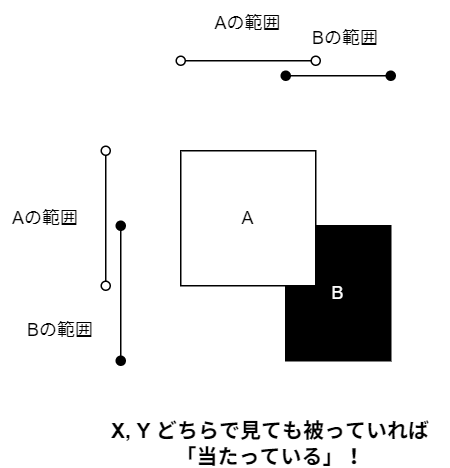
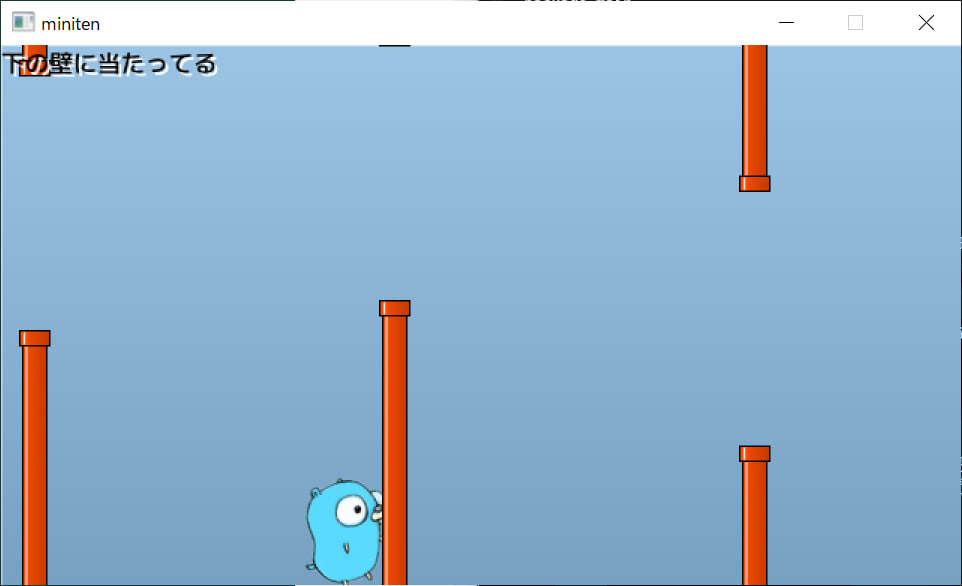

# 第十三章 飞天地鼠游戏 （2）碰撞检测

上次我们制作了游戏的外观。这次，我们将实现游戏的核心“与墙壁的碰撞检测”。

## 命中判定

现实世界中，只要有物体，就一定会能碰撞，但在游戏世界中，仅仅绘制物体并不会触发碰撞检测，而是会被直接忽略。在游戏世界中，穿透墙壁反而是很自然的规律。当你学习了碰撞检测后，希望你能体会到为世界上所有物体添加碰撞检测的难度，并对开发者多一些理解和宽容。

那么，碰撞检测的实现难度，会因为目标的形状而大大改变。这次进行的“未经旋转的矩形之间的碰撞检测”在碰撞检测领域算是相对简单的问题。关于其他形状的碰撞检测，请务必查看传说中的神网站“[从玩游戏到做游戏（日文网站）](http://marupeke296.com/GameMain.html)”。


### 余谈：其他碰撞判定的难度排名
笔者主观地对 2D 游戏中的碰撞判定难度进行了排名。从简单到逐渐变难。

- 圆和点
- 圆和圆
- 未旋转的四边形（以下称 AABB）和点
- AABB 之间  ※此次讨论的内容
- 胶囊和圆形 ※这个非常好用
- 外凸的多角形之间
- 任意的多边形之间（难度高到可怕）

过于复杂的碰撞判定现在多由物理引擎来处理，因此直接制作的机会不多。比起这个，了解具有速度的物体之间的穿透避免等思路更为重要，不过这些内容有机会再进行探讨。

未进行旋转的四角形之间的碰撞判定可以如图所示，通过 X 和 Y 进行分开考虑，无论从哪个角度看都可以判定重叠。



范围重叠可以用“B 的最大值大于 A 的最小值，并且 A 的最大值大于 B 的最小值”这个条件来表示。写成程序就是

```go
aMin < bMax && bMin < aMax
```

语句中的 `&&` （两个&）表示“且”，当左右都为 true 时，这个式子的结果为 true。排列组合 A 和 B 的位置来模拟，能够得出“这样做没问题”这个结论。

| 図                                | aMin < bMax  | bMin < aMax  | 结果         |
| --------------------------------- | ------------ | ------------ | ------------ |
|  | true 真      | true 真      | true 真      |
|  | true 真      | true 真      | true 真      |
|  | true 真      | **false 假** | **false 假** |
|  | **false 假** | true 真      | **false 假** |

接下来只需判断，是否同时在 X 和 Y 方向上都满足条件即可。top 和 bottom 分别意味着顶部和底部。

```go
if (aLeft < bRight && bLeft < aRight) && (aTop < bBottom && bTop < aBottom) {
    // 碰撞到了
}
```

为了将其落实到实际程序中，我们来整理一下逻辑。

- 矩形 A 是地鼠君。
- 矩形 B 是墙。
-  地鼠矩形的范围，是 `从点(x, y) 到点 (x+gopherWidth, y+gopherHeight)` 。
- 上面的墙壁是 `占据的范围是从(wallX, holeY-wallHeight) 到(wallX+wallWidth, holeY)` 。
- 下面的墙壁是 `(wallX, holeY+holeHeight) から (wallX+wallWidth, holeY+holeHeight+wallHeight)` 。

事情变得相当棘手，但只要扎实地一个一个地解开，就不难理解。

```diff-go
package main

import (
	"math/rand/v2"

	"github.com/eihigh/miniten"
)

var (
	x    = 200.0
	y    = 150.0
	vy   = 0.0  // Velocity of y (速度のy成分) の略
	g    = 0.1  // Gravity (重力加速度) の略
	jump = -4.0 // ジャンプ力

	frames     = 0       // 経過フレーム数
	interval   = 120     // 壁の追加間隔
	wallStartX = 640     // 壁の初期X座標
	wallXs     = []int{} // 壁のX座標
	wallWidth  = 20      // 壁の幅
	wallHeight = 360     // 壁の高さ
	holeYs     = []int{} // 穴のY座標
	holeYMax   = 150     // 穴のY座標の最大値
	holeHeight = 170     // 穴のサイズ（高さ）

	gopherWidth  = 60
	gopherHeight = 75
)

func main() {
	miniten.Run(draw)
}

func draw() {
	miniten.DrawImage("sky.png", 0, 0)
	if miniten.IsClicked() {
		vy = jump
	}
	vy += g // 速度に加速度を足す
	y += vy // 位置に速度を足す
	miniten.DrawImage("gopher.png", int(x), int(y))

	// 壁追加処理ここから
	frames += 1
	if frames%interval == 0 {
		wallXs = append(wallXs, wallStartX)
		holeYs = append(holeYs, rand.N(holeYMax))
	}
	// 壁追加処理ここまで

	for i := range wallXs {
		wallXs[i] -= 2 // 少しずつ左へ
	}
	for i := range wallXs {
		// 上の壁の描画
		wallX := wallXs[i]
		holeY := holeYs[i]
		miniten.DrawImage("wall.png", wallX, holeY-wallHeight)

		// 下の壁の描画
		miniten.DrawImage("wall.png", wallX, holeY+holeHeight)

		// gopherくんを表す四角形を作る
		aLeft := int(x)
		aTop := int(y)
		aRight := int(x) + gopherWidth
		aBottom := int(y) + gopherHeight

		// 上の壁を表す四角形を作る
		bLeft := wallX
		bTop := holeY - wallHeight
		bRight := wallX + wallWidth
		bBottom := holeY

		// 上の壁との当たり判定
		if aLeft < bRight &&
			bLeft < aRight &&
			aTop < bBottom &&
			bTop < aBottom {
			miniten.Println("上の壁に当たってる")
		}

		// 下の壁を表す四角形を作る
		bLeft = wallX
		bTop = holeY + holeHeight
		bRight = wallX + wallWidth
		bBottom = holeY + holeHeight + wallHeight

		// 下の壁との当たり判定
		if aLeft < bRight &&
			bLeft < aRight &&
			aTop < bBottom &&
			bTop < aBottom {
			miniten.Println("下の壁に当たってる")
		}
	}
}
```

Go的书写方式，有一套特定的的规则，规则也规定了换行的位置。如果在编辑器中敲换行后引发错误，可以先不换行，遵循编辑器是一个不错的选择。 

当它接触墙壁的时候，如果屏幕左上角显示了消息，则表示程序运作正常。



#### 补充

余談：もっと簡単な方法 余谈：更简单的方法
由于没有通用性，所以没有介绍，但就这个游戏而言，可以通过判断“头部是否碰到上面的墙壁，脚是否碰到下面的墙壁”来更简单地编写。

```go
// 当たり判定
if wallX < int(x)+gopherWidth/2 && int(x)+gopherWidth/2 < wallX+wallWidth {
	head := int(y)                // 頭の高さ
	foot := int(y) + gopherHeight // 足の高さ
	if head < upperWallHeight {
		miniten.Println("上の壁に当たってる")
	}
	if lowerWallY < foot {
		miniten.Println("下の壁に当たってる")
	}
}
```

这个写法之所以能够成立，是因为这个游戏的墙壁必定与地板或天花板相连，否则会出现身体（即头部和脚部之间）碰撞却穿透的现象。
尽管如此，这种方法在分解为 X 和 Y 进行思考这一点上是相同的，因此仔细考虑一下可能会很有趣。

### 床和天花板

顺便说一下，仅靠这些，如果逃到屏幕外的上方和下方，就可以避免碰撞判定。我们来给地板和天花板添加碰撞判定。虽然这样做比与墙壁的碰撞判定简单。这个数值意味着可以稍微超出屏幕底部，但这部分可以根据个人喜好调整。

```diff-go
	...前略...
		// 下の壁との当たり判定
		if aLeft < bRight &&
			bLeft < aRight &&
			aTop < bBottom &&
			bTop < aBottom {
			miniten.Println("下の壁に当たってる")
		}
	}

	if y < 0 {
		miniten.Println("天井に当たってる")
	}
	if 360 < y {
		miniten.Println("床に当たってる")
	}
}
```

## 计分

这个游戏的分数是穿越的墙壁数量。虽然可以考虑多种实现方法，但实际上可以通过“数自己左侧的墙壁数量”这种方式相对简单地实现，所以这次就用这个方法试试看。

```diff-go
func draw() {
	miniten.DrawImage("sky.png", 0, 0)
	score := 0
	for i, wallX := range wallXs {
		if wallX < int(x) {
			score = i + 1
		}
	}
	miniten.Println("Score", score)
	...後略...
```

- `score` 是表示分数的变量。
- `wallX < int(x)` 可以判断 gopher 的左侧是否有墙。gopher 左侧的墙的数量就是得分。
- 从索引 0 开始逐个查看，满足条件后不断覆盖 `score` 。
- 不满足条件，也就是说在 gopher 君右侧的墙不会覆盖 `score` 。因此，最后满足条件（通过）的墙将成为得分。
- 切片索引从 0 开始，但为了计算“通过索引 0 的墙得 1 分，经过 1 的墙得 2 分”，我在索引上加了 1。

短短的代码中，充满了大量信息。这类使用循环的程序，考虑具体的值并逐一分析是非常重要的。

## 本章总结

这次实现了碰撞检测。下次将实现包含游戏结束的画面切换，整理游戏的结构并完成它。
