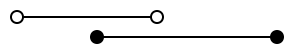
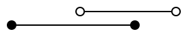
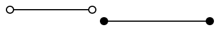
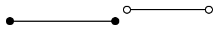

# 第十三章 飞天地鼠游戏 （2）碰撞检测

上次我们制作了游戏的外观。这次，我们将实现游戏的核心“与土管的碰撞检测”。

## 命中判定

现实世界中，只要有物体，就一定会能碰撞，但在游戏世界中，仅仅绘制物体并不会触发碰撞检测，而是会被直接忽略。游戏世界中，穿墙反而是自然规律。当你学习了碰撞检测后，希望你能体会到为世界上所有的物体添加碰撞检测的难度，并对开发者多一些理解和宽容。

碰撞检测的实现难度，会因为目标的形状而大大改变。这次做的“未经旋转的矩形之间的碰撞检测”，在碰撞检测领域算是相对简单的问题。关于其他形状的碰撞检测，请务必查看传说中的神网站“[从玩游戏到做游戏（日文网站）](http://marupeke296.com/GameMain.html)”。


### 余谈：各种碰撞判定的难度排名
笔者主观地对 2D 游戏中的碰撞判定难度排了一下名。从上到下，由简单逐渐变难。

- 圆和点
- 圆和圆
- 未旋转的四边形（以下称 AABB）和点
- AABB 之间  ※此次讨论的内容
- 胶囊和圆形 ※这个非常好用
- 外凸的多角形之间
- 任意形状的多边形之间（难度高到可怕）

过于复杂的碰撞判定现在多由物理引擎处理，直接手写的机会不多。比起这个，学会“避免运动物体穿墙”的思路更为重要，所以高级内容有机会再进行探讨。

未被旋转的四角形之间的碰撞判定如图所示，把 X 和 Y 分开考虑之后，无论从哪边入手都可以判定重叠。


矩形的重叠，等效于“B 的最大值大于 A 的最小值，且 A 的最大值小于 B 的最小值”这个条件语句。

翻译成程序就是：

```go
aMin < bMax && bMin < aMax
```

语句中的 `&&` （两个&）表示“且”，当左右都为 true 时，这个式子的结果为 true。

排列组合 A 和 B 的位置来模拟，能够得出“这样判断没问题”的结论。

| 图                                | aMin < bMax | bMin < aMax | 结果      |
| --------------------------------- | ----------- | ----------- | --------- |
|  | true        | true        | true      |
|  | true        | true        | true      |
|  | true        | **false**   | **false** |
|  | **false**   | true        | **false** |

接下来只需判断，是否同时在 X 和 Y 方向上都满足类似的条件即可。top 和 bottom ，分别意味着顶部和底部。

```go
if (aLeft < bRight && bLeft < aRight) && (aTop < bBottom && bTop < aBottom) {
    // 碰撞到了
}
```

为了将其落实到实际程序中，我们来整理一下逻辑。

- 矩形 A 是地鼠君。
- 矩形 B 是墙。
-  地鼠矩形的范围，是 `从点(x, y) 到点 (x+gopherWidth, y+gopherHeight)` 。
- 上面的土管是 `占据的范围是从(wallX, holeY-wallHeight) 到(wallX+wallWidth, holeY)` 。
- 下面的土管是 `(wallX, holeY+holeHeight) から (wallX+wallWidth, holeY+holeHeight+wallHeight)` 。

事情变得相当棘手，但只要扎实地分步解开，就不难理解。

```diff-go
package main

import (
	"math/rand/v2"

	"github.com/eihigh/miniten"
)

var (
	x    = 200.0
	y    = 150.0
	vy   = 0.0  // Y方向速度(Velocity of y)的缩写
	g    = 0.1  // 重力加速度(Gravity) 的缩写
	jump = -4.0 // 跳跃力

	frames     = 0       // 经过的帧总数
	interval   = 120     // 土管追加间隔
	wallStartX = 640     // 土管的初始X坐标
	wallXs     = []int{} // 土管的X坐标
	wallWidth  = 20      // 土管的宽度
	wallHeight = 360     // 土管的高度
	holeYs     = []int{} // 空洞的Y坐标
	holeYMax   = 150     // 空洞的Y坐标的最大值
	holeHeight = 170     // 空洞的大小（高度）

	gopherWidth  = 60
	gopherHeight = 75
)

func main() {
	miniten.Run(draw)
}

func draw() {
	miniten.DrawImage("sky.png", 0, 0)
	if miniten.IsClicked() {
		vy = jump
	}
	vy += g // 新的当前速度 = 当前速度+加速度
	y += vy // 新的当前位置 = 当前位置+速度
	miniten.DrawImage("gopher.png", int(x), int(y))

	// 从这里开始，写追加土管的代码
	frames += 1
	if frames%interval == 0 {
		wallXs = append(wallXs, wallStartX)
		holeYs = append(holeYs, rand.N(holeYMax))
	}
	// 追加土管的代码，到这里就结束了

	for i := range wallXs {
		wallXs[i] -= 2 // 往左动
	}
	for i := range wallXs {
		// 描绘上面的土管
		wallX := wallXs[i]
		holeY := holeYs[i]
		miniten.DrawImage("wall.png", wallX, holeY-wallHeight)

		// 描绘下面的土管
		miniten.DrawImage("wall.png", wallX, holeY+holeHeight)

		// 制作表示地鼠的矩形
		aLeft := int(x)
		aTop := int(y)
		aRight := int(x) + gopherWidth
		aBottom := int(y) + gopherHeight

		// 定义表示上面土管的矩形 
		bLeft := wallX
		bTop := holeY - wallHeight
		bRight := wallX + wallWidth
		bBottom := holeY

		// 上面土管的判定
		if aLeft < bRight &&
			bLeft < aRight &&
			aTop < bBottom &&
			bTop < aBottom {
			miniten.Println("碰到上面的土管了")
		}

		// 定义表示下面土管的矩形
		bLeft = wallX
		bTop = holeY + holeHeight
		bRight = wallX + wallWidth
		bBottom = holeY + holeHeight + wallHeight

		// 地鼠与下面土管的碰撞判定
		if aLeft < bRight &&
			bLeft < aRight &&
			aTop < bBottom &&
			bTop < aBottom {
			miniten.Println("碰到下面的土管了")
		}
	}
}
```

Go的书写格式有一套特定的规则，也规定了换行的位置。如果在编辑器中敲换行后引发错误，取消换行，遵循编辑器的建议是一个不错的选择。 

地鼠接触土管的时候，如果屏幕左上角显示了消息，则表示程序运作正常。


#### 补充

补充：更简单的方法
由于没有通用性，所以没有重点介绍。但这个游戏，可以通过判断“头部是否碰到上面的土管，脚是否碰到下面的土管”来更简单地判断。

```go
// 碰撞判定
if wallX < int(x)+gopherWidth/2 && int(x)+gopherWidth/2 < wallX+wallWidth {
	head := int(y)                // 地鼠头部的位置
	foot := int(y) + gopherHeight // 地鼠脚尖的位置
	if head < upperWallHeight {
		miniten.Println("碰到上面的土管了")
	}
	if lowerWallY < foot {
		miniten.Println("碰到下面的土管了")
	}
}
```

这个写法之所以成立，是因为这个游戏内的土管，必定与地板或天花板相连，否则会出现地鼠（的头部和脚部）走捷径穿透土管的现象。
尽管如此，这个方案，也用了将问题分解为 X 和 Y 两个方向，将问题化整为零的做法。仔细考虑一下，可能会很有意思。

### 床和天花板

顺便说一下，仅靠上述代码，如果地鼠逃到屏幕外的上面和下面，就可以永远避免触发碰撞判定。我们来给地板和天花板添加碰撞判定。做法比与土管的碰撞判定简单。目前的数值，可以允许稍微超出屏幕底部，但这部分可以根据个人喜好调整。

```diff-go
	...前略...
		// 底部的碰撞判定
		if aLeft < bRight &&
			bLeft < aRight &&
			aTop < bBottom &&
			bTop < aBottom {
			miniten.Println("碰到底边了")
		}
	}

	if y < 0 {
		miniten.Println("碰到天花板")
	}
	if 360 < y {
		miniten.Println("碰到底边了")
	}
}
```

## 计分

这个游戏的分数，基于穿越的土管数量。虽然可以考虑其他做法，但是“数自己左侧的土管数量”的算法简单易懂，所以这次就用这个方法试试看。

```diff-go
func draw() {
	miniten.DrawImage("sky.png", 0, 0)
	score := 0
	for i, wallX := range wallXs {
		if wallX < int(x) {
			score = i + 1
		}
	}
	miniten.Println("Score", score)
	...后略...
```

- `score` 是表示分数的变量。
- `wallX < int(x)` 可以判断 gopher 的左侧是否有墙。gopher 左侧的土管的数量就是得分。
- 从索引 0 开始逐个查看，满足条件后不断覆盖 `score` 。
- 不满足条件，也就是说在 gopher 君右侧的墙不会覆盖 `score` 。因此，最后满足条件（通过）的墙将成为得分。
- 切片索引从 0 开始，但为了计算“通过索引 0 的墙得 1 分，经过 1 的墙得 2 分”，我在索引上加了 1。

短短的代码中，充满了大量信息。这类使用循环的程序，考虑具体的值并逐一分析是非常重要的。

## 本章总结

这次实现了碰撞检测。下次将实现包含游戏结束的画面切换，整理游戏的结构并完成它。
