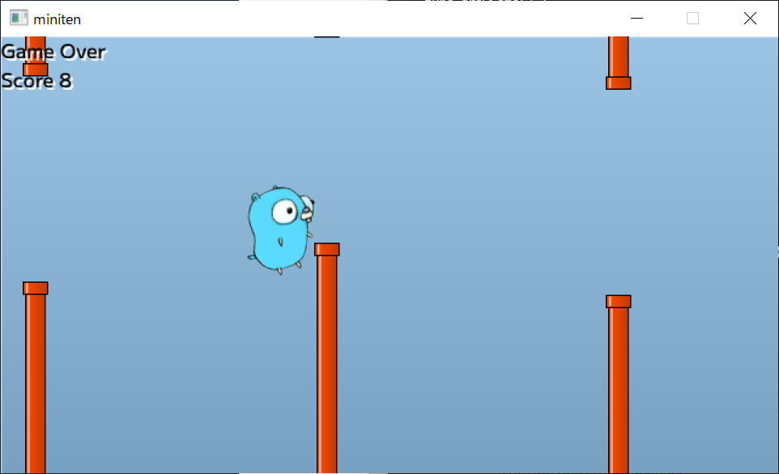

# 第十四章 飞天地鼠游戏 （3）场景切换

前面的内容里，已经实现了判定和计分，游戏的核心部分完成了。这次，我们将构建被称为场景切换的外部功能。

## 场景切换

前回我们实现了碰撞判定，但显然还没有实现游戏结束的处理。此外，游戏启动后直接开始也不太友好，显得有些冷清。标题画面也是必要的。将屏幕切换为另一个状态的处理，被称为**屏幕切换或场景切换**。

### 设计画面

在实现画面迁移之前，我们先考虑一下需要哪些画面。这次我们将制作以下三个画面。

-  标题画面。点击后游戏开始。
- 游戏画面。撞到墙壁就会游戏结束。
- 游戏结束画面。显示分数，点击后返回标题画面。

### 考虑骨架结构

画面迁移虽然听起来复杂，但本质上只是一个 switch 语句。骨架大致是这样的，根据表示画面的变量 `scene` 来分支处理该帧的操作。 `scene` 是在满足下一个画面迁移条件时会被更改的东西。反过来说，在不满足迁移条件的情况下，始终保持相同的 `scene` 。

```go
var scene = "title" // どの画面にいるかを保持する変数

func draw() {
	switch scene {
	case "title":
		// タイトル画面の処理
		// クリックされたら scene = "game" にする

	case "game":
		// ゲーム画面の処理
		// 壁にぶつかったら scene = "gameover" にする

	case "gameover":
		// ゲームオーバー画面の処理
		// クリックされたら scene = "title" にする
	}
}
```

这样虽然简单，但如果将之前实现的 draw 函数的内容移到 `case "game":` 下面，就会变得非常难以阅读。

```go
	case "game":
		// スコアの計算
		// クリックしてジャンプ
		// 壁を追加する
		// 壁を移動する
		// 壁の描画
		// 壁との当たり判定
		// 天井、床との当たり判定
		// ...
```

在这种情况下，通过自己创建函数（处理的集合）来整理代码吧。使用函数时，switch 语句可能会是这样的。

```go
func draw() {
	switch scene {
	case "title":
		drawTitle()

	case "game":
		drawGame()

	case "gameover":
		drawGameover()
	}
}

func drawTitle() {
	// タイトル画面の処理
}

func drawGame() {
	// 前回までのdraw関数と同じ
	// スコアの計算
	// クリックしてジャンプ
	// ...
}

func drawGameover() {
	// ゲームオーバー画面の処理
}
```

反映到实际的程序中：

```diff-go
package main

import (
	"math/rand/v2"

	"github.com/eihigh/miniten"
)

var (
	x    = 200.0
	y    = 150.0
	vy   = 0.0  // Velocity of y (速度のy成分) の略
	g    = 0.1  // Gravity (重力加速度) の略
	jump = -4.0 // ジャンプ力

	frames     = 0       // 経過フレーム数
	interval   = 120     // 壁の追加間隔
	wallStartX = 640     // 壁の初期X座標
	wallXs     = []int{} // 壁のX座標
	wallWidth  = 20      // 壁の幅
	wallHeight = 360     // 壁の高さ
	holeYs     = []int{} // 穴のY座標
	holeYMax   = 150     // 穴のY座標の最大値
	holeHeight = 170     // 穴のサイズ（高さ）

	gopherWidth  = 60
	gopherHeight = 75

	scene = "title"
)

func main() {
	miniten.Run(draw)
}

func draw() {
	switch scene {
	case "title":
		drawTitle()

	case "game":
		drawGame()

	case "gameover":
		drawGameover()
	}
}

func drawTitle() {
}

func drawGame() {
	// 前回までのdraw関数と同じなので割愛
}

func drawGameover() {
}
```

执行此操作时， `drawTitle` 的处理为空，因此不会发生任何事情。让我们制作标题画面。

背景和“点击开始”的提示，同时显示 gopher 君。如果大家能跟到这里，理解这个应该没问题吧。

```go
func drawTitle() {
	miniten.DrawImage("sky.png", 0, 0)
	miniten.Println("クリックしてスタート")
	miniten.DrawImage("gopher.png", int(x), int(y))
	if miniten.IsClicked() {
		scene = "game"
	}
}
```

这下点击后就可以开始游戏了。接下来我们将制作游戏结束画面。

今まで当たり判定部分では当たった旨を左上に表示するのみでしたが、ゲームオーバー画面に遷移するために `scene = "gameover"` に書き換えます。
今まで当たり判定部分では当たった旨を左上に表示するのみでしたが，游戏结束画面に遷移するためにに書き換えます。

之前的游戏结束画面，都是用左上角显示一行文字来代替。接下来用 `scene = "gameover"` ，显示专门的游戏结束画面。

在 drawGameover 函数中，显示游戏结束的消息和最后的分数。由于分数仍然是局部变量，因此无法在 drawGameover 函数中使用，所以需要将其改为全局变量。

 将以上两个变更，反映到实际的程序中。

!削除部分为红色（TODO）。

```diff-go
package main

import (
	"math/rand/v2"

	"github.com/eihigh/miniten"
)

var (
	x    = 200.0
	y    = 150.0
	vy   = 0.0  // Velocity of y (速度のy成分) の略
	g    = 0.1  // Gravity (重力加速度) の略
	jump = -4.0 // ジャンプ力

	frames     = 0       // 経過フレーム数
	interval   = 120     // 壁の追加間隔
	wallStartX = 640     // 壁の初期X座標
	wallXs     = []int{} // 壁のX座標
	wallWidth  = 20      // 壁の幅
	wallHeight = 360     // 壁の高さ
	holeYs     = []int{} // 穴のY座標
	holeYMax   = 150     // 穴のY座標の最大値
	holeHeight = 170     // 穴のサイズ（高さ）

	gopherWidth  = 60
	gopherHeight = 75

	scene = "title"
	score = 0 // スコアのグローバル変数
)

func main() {
	miniten.Run(draw)
}

func draw() {
	switch scene {
	case "title":
		drawTitle()

	case "game":
		drawGame()

	case "gameover":
		drawGameover()
	}
}

func drawTitle() {
	miniten.DrawImage("sky.png", 0, 0)
	miniten.Println("クリックしてスタート")
	miniten.DrawImage("gopher.png", int(x), int(y))
	if miniten.IsClicked() {
		scene = "game"
	}
}

func drawGame() {
	miniten.DrawImage("sky.png", 0, 0)
	// score := 0 // 削除
	for i, wallX := range wallXs {
		if wallX < int(x) {
			score = i + 1
		}
	}
	miniten.Println("Score", score)
	if miniten.IsClicked() {
		vy = jump
	}
	vy += g // 速度に加速度を足す
	y += vy // 位置に速度を足す
	miniten.DrawImage("gopher.png", int(x), int(y))

	// 壁追加処理ここから
	frames += 1
	if frames%interval == 0 {
		wallXs = append(wallXs, wallStartX)
		holeYs = append(holeYs, rand.N(holeYMax))
	}
	// 壁追加処理ここまで

	for i := range wallXs {
		wallXs[i] -= 2 // 少しずつ左へ
	}
	for i := range wallXs {
		// 上の壁の描画
		wallX := wallXs[i]
		holeY := holeYs[i]
		miniten.DrawImage("wall.png", wallX, holeY-wallHeight)

		// 下の壁の描画
		miniten.DrawImage("wall.png", wallX, holeY+holeHeight)

		// gopherくんを表す四角形を作る
		aLeft := int(x)
		aTop := int(y)
		aRight := int(x) + gopherWidth
		aBottom := int(y) + gopherHeight

		// 上の壁を表す四角形を作る
		bLeft := wallX
		bTop := holeY - wallHeight
		bRight := wallX + wallWidth
		bBottom := holeY

		// 上の壁との当たり判定
		if aLeft < bRight &&
			bLeft < aRight &&
			aTop < bBottom &&
			bTop < aBottom {
			scene = "gameover"
		}

		// 下の壁を表す四角形を作る
		bLeft = wallX
		bTop = holeY + holeHeight
		bRight = wallX + wallWidth
		bBottom = holeY + holeHeight + wallHeight

		// 下の壁との当たり判定
		if aLeft < bRight &&
			bLeft < aRight &&
			aTop < bBottom &&
			bTop < aBottom {
			scene = "gameover"
		}
	}

	if y < 0 {
		scene = "gameover"
	}
	if 360 < y {
		scene = "gameover"
	}
}

func drawGameover() {
	// 背景、gopher、壁の描画はdrawGame関数のコピペ
	miniten.DrawImage("sky.png", 0, 0)
	miniten.DrawImage("gopher.png", int(x), int(y))
	for i := range wallXs {
		// 上の壁の描画
		wallX := wallXs[i]
		holeY := holeYs[i]
		miniten.DrawImage("wall.png", wallX, holeY-wallHeight)

		// 下の壁の描画
		miniten.DrawImage("wall.png", wallX, holeY+holeHeight)
	}

	miniten.Println("Game Over")
	miniten.Println("Score", score)
}
```

这下，我们已经完成了游戏结束画面的绘制。



然后同样在游戏结束画面点击后会显示 `scene = "title"` 就结束了……本来想这么说，但遗憾的是这并不奏效。

- 游戏结束画面如果 `miniten.IsClicked()` 为 true，则变为 `scene = "title"` 
- 在下一个帧中进行显示标题画面的处理
- 在下一个帧中（除非在一个帧内瞬间放开手指）， `miniten.IsClicked()` 将再次变为 true
- 因此游戏结束的标题画面瞬间被跳过，游戏再次开始

因此，需要写一种判断“玩家没有持续按下按钮，只按下了一瞬间”的方法，以及重置游戏状态的处理。

## 刚好被按下的判定


要判断按钮没有持续按下，而只是按下一瞬间，可以判断前一帧没有被按下，而当前帧被按下了即可。这个处理在任何画面中都很方便，所以我们可以把它写在 draw 函数的开头。prev 是 previous（前一个）的缩写。

 `!` 表示否定/not， `!true` 等于 `false` ， `!false` 等于 `true` 。

```diff-go
package main

import (
	"math/rand/v2"

	"github.com/eihigh/miniten"
)

var (
	// ...中略...
	scene = "title"
	score = 0

	isPrevClicked = false // 前のフレームでクリックされていたか
	isJustClicked = false // 今のフレームでクリックされたか
)

func main() {
	miniten.Run(draw)
}

func draw() {
	// 今のフレームでクリックされたか = 今のフレームでクリックされていて、前のフレームでクリックされていない
	isJustClicked = miniten.IsClicked() && !isPrevClicked
	// 次のフレームに備えて、クリックされたかを保存しておく
	isPrevClicked = miniten.IsClicked()

	switch scene {
	case "title":
	// ...後略...
```

将这个 `isJustClicked` 用于游戏结束画面和标题画面。

```diff-go
func drawTitle() {
	miniten.DrawImage("sky.png", 0, 0)
	miniten.Println("クリックしてスタート")
	miniten.DrawImage("gopher.png", int(x), int(y))
	if isJustClicked {
		scene = "game"
	}
}

// ...中略...

func drawGameover() {
	// 背景、gopher、壁の描画はdrawGame関数のコピペ
	miniten.DrawImage("sky.png", 0, 0)
	miniten.DrawImage("gopher.png", int(x), int(y))
	for i := range wallXs {
		// 上の壁の描画
		wallX := wallXs[i]
		holeY := holeYs[i]
		miniten.DrawImage("wall.png", wallX, holeY-wallHeight)

		// 下の壁の描画
		miniten.DrawImage("wall.png", wallX, holeY+holeHeight)
	}

	miniten.Println("Game Over")
	miniten.Println("Score", score)
	if isJustClicked {
		scene = "title"
	}
}
```

这下可以安全地按住而不会被跳过了。

## 游戏结束时的重置

接下来只需重置游戏状态，以便从头开始重新游玩。gopher 君和墙壁的状态将在游戏结束画面中保持以便绘制，并希望在返回标题画面的瞬间重置，因此将在 `if isJustClicked` 中编写重置处理。

```diff-go
	if isJustClicked {
		scene = "title"

		x = 200.0
		y = 150.0
		vy = 0.0
		frames = 0
		wallXs = []int{}
		holeYs = []int{}
		score = 0
	}
```


这下可以全面体验游戏了。辛苦了！㊗️🎊💯💯

## 更多的磨练

因此，本书中制作的 flappy 游戏暂时完成，但仍然有进一步打磨的空间。即使不加新功能，也可以

- 让玩家角色动起来
- 利用滚动效果精心设计背景。
- 将碰撞判定的大小缩小以提升舒适感。
- 随着进程的推进，逐渐改变洞口的高度、宽度和移动速度等，增加难度。


可以考虑这样的打磨方式，如果之后入门 Ebitengine，

-  旋转玩家角色等。
- 碰到墙壁时发出声音。
-  更改显示分数的位置。
-  添加游戏结束的演出。


等等，有无数的事情可以做。即使在程序上并不困难实现，也有很多潜在的优化点可以大大提升趣味性，所以请不要满足于此，追求属于你自己的原创游戏吧。

## 扩展


这次制作的跳跃 gopher 君游戏包含了跳跃的行为和碰撞判定，可以说是动作游戏（沙盒游戏/平台游戏）的基础。唯一的区别是，当碰到地形时是游戏结束还是可以站在地形上。所有的一切都是相互关联的呢～。在本书中稍后会实际尝试制作动作游戏（可能。计划中）。

## 本章总结

通过画面迁移，我们整理了整个程序的流程，学习了构建游戏的流程。这种画面迁移，或者广义上的状态迁移（例如 isJustClicked），是程序中较难适当管理的内容之一。当能够编写画面迁移时，我认为可以作为一名合格的程序员而自豪了。

如前所述，虽然程序本身仍然有很多可以改进的空间，但是本章的地鼠游戏，将在这里告一段落。从下次开始，我们将挑战不同的事物。
