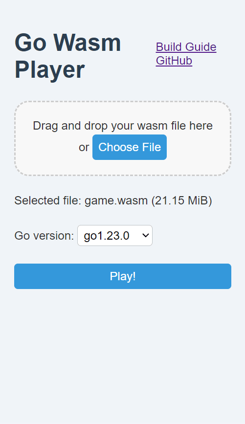

# 第十五章 发布游戏让朋友玩（编译和分发）


前几章顺利完成了一款游戏。既然制作了有趣的游戏，就希望其他人也能来玩。因此这次将介绍游戏的分发和游玩方法。


近年来，通过网络分发游戏并让人们玩耍已变得越来越普遍。Ebitengine 在网络分发方面也非常方便，因此请尽情将您的力作向世界发布吧！

## 编译


在编程世界中，创造某种成果物被广泛称为编译（build）。成果物的种类有很多，但本书所讨论的编译是“制作可以作为游戏运行的文件”。让我们在这一页学习编译的方法，旨在分发成果物并让人们来玩。


Go 的编译是不可或缺的，实际上到目前为止多次执行的 `go run .` 命令，在后台已经将“编译和执行成果物”这两个步骤合并在一起。要单独进行编译并生成成果物，可以使用 `go build` 命令。

```
$ go build
```


然后目录中应该生成了可执行文件。在 Windows 中，文件会带有 `.exe` 扩展名，但在 macOS 或 Linux 中则没有扩展名。请通过资源管理器或其他方式打开生成的文件，双击运行，确认游戏是否如以前一样正常运行。

### 余谈：编译与链接
GGo 的编译由两个主要步骤组成：将程序翻译成机器语言的编译（compile），以及将其汇总为可执行文件的链接（link）。然而，由于链接步骤的存在感较弱，以及为了区分不需要编译的语言，加上多年的惯例，整个编译过程常常被称为编译。

这下成果物终于完成了，接下来只要分发就可以了……本来想这么说，但实际上并不是这样。

## 嵌入资源

请尝试将此可执行文件移动到桌面等其他位置后再运行。此时，图像应该不会显示。这是因为可执行文件正在读取同一目录中的图像文件，而在其他位置找不到这些文件，因此无法显示。


作为对策，将图像文件与可执行文件一起移动就可以正常运行，但 Go 有更智能的方法。那就是嵌入（embed）。嵌入是在编译时将所需文件作为可执行文件的一部分嵌入，这样只需携带一个可执行文件就能实现的梦幻功能。


早速前回制作的弹跳 gopher 游戏进行嵌入尝试。要点如下：

- `import "embed"` 导入 `embed` 包
- `//go:embed` 这个特殊的注释用于指定要嵌入的文件
  -  `//` 和 `go:embed` 之间不要留空格！
  -  `*.png` 的意思是指定“同一目录下的所有 PNG 文件”
- 紧接着声明变量 `var fsys embed.FS` 
  - 通过这个变量可以使用嵌入的文件
- `miniten.DrawImageFS` 函数用于绘制嵌入的图像
  - DrawImage 函数取 `名前, X, Y` 个参数，但 DrawImageFS 取 `fsys, 名前, X, Y` 个参数
  - 数量虽然很多，但努力将其全部替换

### 其他详细信息
embed 模式的指定方法有些特殊，详细信息请参阅[官方文档（英文）](https://pkg.go.dev/embed)。
 `//go:embed `的方式， // 之后不接空格，然后 A:B 这样书写格式的特殊注释称为**编译指令(directive)**。Go 还有其他编译指令，如`//go:generate`。


```diff-go
package main

import (
	"embed"
	"math/rand/v2"

	"github.com/eihigh/miniten"
)

//go:embed *.png
var fsys embed.FS

var (
	x    = 200.0
	y    = 150.0
	vy   = 0.0  // Velocity of y (速度のy成分) の略
	// ...中略...
)

func main() {
	miniten.Run(draw)
}

func draw() {
	// ...中略...
}

func drawTitle() {
	miniten.DrawImageFS(fsys, "sky.png", 0, 0)
	miniten.Println("クリックしてスタート")
	miniten.DrawImageFS(fsys, "gopher.png", int(x), int(y))
	if isJustClicked {
		scene = "game"
	}
}

func drawGame() {
	miniten.DrawImageFS(fsys, "sky.png", 0, 0)
	// 以下、同様に DrawImage をすべて DrawImageFS に置き換えること
	// ...後略...
```

这个程序将正常编译。

```
$ go build
```

将生成的可执行文件移动到其他位置并尝试运行。应该会显示图像。

## 考虑如何分发游戏

生成的可执行文件可以通过 USB 闪存、便携式 SSD，或者使用 Google Drive、Dropbox、GigaFile  等文件共享服务进行分发。然而，近年来，因安全原因对从互联网下载可执行文件的警惕性逐年提高，常常会出现明明已经分发却无法下载和执行的情况。因此，我推荐以 Web 浏览器可玩形式进行分发。

以网页浏览器可玩形式进行分发，用户可以在避免上述问题的同时，在浏览器上玩游戏。此外，这也是分发**可在手机上玩的游戏**的最短路径，具有强大的优势。

## 以可在网页浏览器中游玩的形式编译

在 Go 中，只需对编译命令稍作修改，就可以 WebAssembly 这种可以在 Web 浏览器中执行的格式进行编译。

macOS (zsh) 的使用更简单，因此先介绍它，

```
$ GOOS=js GOARCH=wasm go build -o game.wasm
```

只需像这样执行（注意不要在 `=` 的两侧添加空格）。此外，虽然可以不指定成果物的文件名 `-o game.wasm` ，但如果不指定，通常很难与普通的可执行文件区分，因此建议添加。

Windows 有点麻烦，而且在 PowerShell 和 cmd.exe 中的做法也不同，因此我将介绍一种可以随时通用（甚至在 macOS 上也能使用）的 `go env -w` 的方法。

```
$ go env -w GOOS=js GOARCH=wasm
$ go build -o game.wasm
$ go env -u GOOS GOARCH
```

`go env -w` 是一个用于修改环境变量（类似于设置值）的命令，这里正在修改 `GOOS` 和 `GOARCH` 。不过，这种修改将会一直生效，因此在编译工作完成后，请使用 `go env -u` 恢复原状。


### 关于环境变量

环境变量是指存储有关程序执行环境的信息的操作系统提供的变量。通过使用 go env 命令，可以查看当前环境变量的值。

在 Go 中，可以使用 GOOS 和 GOARCH 这两个环境变量来指定编译时的目标操作系统和架构。为与使用 Go 的环境不同的操作系统或架构进行编译的过程称为交叉编译。

Go 的一个特点是交叉编译非常简单。

### GOOS=js GOARCH=wasm 是什么
GOOS=js 表示 Web 浏览器，GOARCH=wasm 表示 WebAssembly。 js 是 JavaScript 的缩写。这个设置值的规则，应该有过有过深入的讨论，但作者并没有深入研究。

无论如何，生成 `game.wasm` 这个文件就是成功。

## 执行 WebAssembly 的办法

WebAssembly 形式无法通过双击执行。执行需要浏览器。而且在 Go 的情况下，除了 WebAssembly 形式的成果物外，还需要准备一些其他文件，但令人惊讶的是，**可以使用作者制作的 Go Wasm Player 轻松执行**！
访问 [go-wasm-player.pages.dev](https://go-wasm-player.pages.dev/)，只需拖放或点击选择 `game.wasm` ，即可运行 WebAssembly 格式的游戏。请务必试试看。



## 发布游戏

成功自己确认可以在 Go Wasm Player 中游玩后，接下来只需通过文件共享服务等分发这个 `game.wasm` 。与想要游玩的人分享 `game.wasm` ，让他们在 Go Wasm Player 中游玩。当然，手机也可以像电脑一样游玩。我认为， `game.wasm` 的分发与可执行文件的分发不同，应该不会因为安全问题而被拒绝。

文件共享服务的使用方法就不赘述了，但像 Google Drive 和 Dropbox 等许多云存储不仅有存储自己文件的功能，还有与他人共享文件的功能，所以我们应该积极使用。

## 注意事项


不过，正如之前提到的，**miniten 的 draw  函数被调用的频率可能因环境而异**（具体来说，可能会与显示器的刷新率相匹配）。这意味着游戏速度可能会因环境而变化。Ebitengine  提供了在任何环境中以固定频率调用的 Update 函数，因此如果您想正式发布游戏，建议您继续阅读本书，尽快从 miniten毕业，并使用  Ebitengine 的 Update 函数。

此外，Go Wasm Player 的选择框在编译 `game.wasm` 时与 Go 版本不匹配会导致错误，因此可以告诉玩家 Go 的版本，或者从右上角的 `Share wasm` 分享包含 Go 版本的链接。

## 更进一步的分发方式

Go Wasm Player 需要先下载 `game.wasm` 文件，但 WebAssembly 的真正优势在于无需下载。像这款游戏[“猫的愿望能实现”](https://odencat.com/odencatanniversary/ja.html?openExternalBrowser=1)，只需点击链接即可玩游戏。

要实现这一点，您需要自己发布网页。虽然详细信息省略了，但使用这个 [wasmgame](https://github.com/eihigh/wasmgame)，您可以在 GitHub Pages 的机制上免费发布原创网页，并在其中嵌入游戏。如果您有 HTML 和 CSS  的知识，您还可以自由设计游戏外部的页面。现在即使不签订租用服务器的合同也可以发布网页哦，太太。

或者，您也可以利用 [itch.io](https://itch.io/) 或 [PLiCy](https://plicy.net) 等游戏发行平台。我想您会被要求提供一个包含所需文件的 zip 文件，但 wasmgame 也支持生成这个  zip  文件，所以请务必尝试一下。利用这些平台来推广自己的游戏，或者参加游戏开发节（在有限的时间和特定主题下制作游戏的活动）来提升自己的技能，都是不错的选择。

## 移动应用开发

可以通过真正的移动应用程序进行分发，而不是通过浏览器。有关详细信息，请参阅 [Ebitengine 的官方文档](https://plicy.net)或志愿者撰写的文章。


Go 和 Ebitengine 非常易于使用，但由于移动应用需要遵循 iOS 和 Android 施加的限制，因此稍微有些难度。如果您感兴趣，请务必尝试一下。

## 家庭用游戏机开发


其实 Ebitengine 也支持 Nintendo Switch 和  Xbox！

...不过，前提是得到任天堂或微软的人邀请为他们开发游戏，所以可能最好把它当作未来的美好梦想来期待。

不过，手边运行的游戏能够直接在  Nintendo Switch 等平台上运行，确实是个非常吸引人的话题。
对技术话题感兴趣的朋友可以参考[这篇文章](https://zenn.dev/hajimehoshi/articles/72f027db464280)。


## 使用 Go 命令进行游戏

最后，介绍一种开发者之间共享游戏的最简单方法。实际上在环境编译页面中也有介绍， `go run` 可以直接在互联网上运行程序。这个命令将执行 Ebitengine 的示例游戏“跳跃的 gopher 君”。

```
$ go run github.com/hajimehoshi/ebiten/v2/examples/flappy@latest
```

**! 请只运行可信的程序！**

此命令直接执行互联网上的程序，如果执行恶意程序，将完全无防备，允许入侵计算机。执行时请务必确认对方是可信的人。

在互联网上放置程序，GitHub 这个服务是最流行和方便的选择。虽然界面只有英文，但有很多热心人士提供的资料，所以一定没问题。

在 Go 中处理这种 `go run` 时，需要正确初始化 `go.mod` 。例如，如果我 (eihigh) 要将其发布到名为 flappy 的仓库（程序存放处），

```
$ go mod init github.com/eihigh/flappy
```

将其初始化为如上所示。在此状态下，照常进行开发，并**推送**到 GitHub（**推送**与上传同义），即可运行 `go run github.com/eihigh/flappy@latest` 。

GitHub 是开发者之间交流的场所，目前是世界上最活跃的地方，因此如果有机会，强烈推荐您尝试一下。

## 本章总结

这次介绍了如何编译和分发游戏。如果您有其他语言的经验，您一定会对为多种环境编译的简单性感到惊讶。此外，嵌入功能是 Go 游戏开发中特别容易感受到好处的功能，请务必好好利用。

通过网络分发游戏在最近变得非常普遍，因此一旦能够通过网络分发，能够做的事情将大大增加，更多的人将能够享受自己的游戏。移动设备、家用游戏机以及 Steam 等更是更进一步，但当然 Ebitengine 是支持的，因此将其作为未来的目标也是一个不错的选择。
