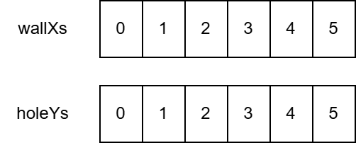

# 第十六章 把数据放在一起（结构体）

上次我们学习了如何构建和分发完成的游戏。这次我们将正式开始学习 Go 和 Ebitengine，重点讲解之前不足的 Go 功能，以及基于这些功能的 Ebitengine 使用方法。
首先，让我们学习如何使用结构体来整合数据。

## 结构体

**结构体/struct** 是将多个数据汇总为一个的功能，类似于便当盒，可以将多个物品组合在一起。结构体最简单的用法如下所示。

```go
package main

import "fmt"

var p struct { // p は 位置/position の頭文字
	x int
	y int
}

func main() {
	p.x = 3
	p.y = 4
	fmt.Println(p)
}
$ go run .
{3 4}
```

中间的换行可能会让人觉得怪，但变量 `p` 的类型是 `struct 的{` 到 `}` 。


通过这种方式定义类型，变量 `p` 将内部包含两个 int 类型的变量 `x` 和 `y` 。结构体内部的每一个变量称为**字段/field**，并在结构体类型的变量名后加上点 `.` 来取值。在上述程序中，分别给 `p` 中的 `p.x` 和 `p.y` 赋值。

## 类型宣言

```go
var x0 int
var x1 int
```


增加一个 `int` 类型的变量很简单，但如果想增加结构体类型的变量，由于类型中有换行，且较长，准确地写出所有字段的名称和类型就很麻烦。因此，通常会在类型声明中给结构体起一个喜欢的别名，以便于重复使用。类型宣言的语法是 `type 新的类型名 原类型名` ，如下所示。

```go
// 構造体型を元に、新たな型 position を宣言する
type position struct {
	x int
	y int
}

// 新たな型を利用する
var p0 position
// 何度でも利用できる
var p1 position
var p2 position

// p0, p1, p2 いずれもフィールド x, y を持つ。
```

类型宣言中还有“能够声明类型相关的函数”这个附带效果，但这稍后再说。

### 扩展解说

实际上不仅限于结构体， int 等各种类型都可以作为基础进行类型声明，但这是声明方法的高级用法，因此省略。

## 结构体的值的表示


结构体也可以像数组和切片一样使用**复合字面量**通过 `类型名称{字段的值, 字段的值...}` 表示值。

```go
// position 型が宣言済みとする

func main() {
	p := position{3, 4} // xの値、yの値
	fmt.Println(p) // {3 4}
}
```

此外，还可以使用 `{字段名称: 字段的值, 字段名称: 字段的值 ...}` 这种语法。用法是

```go
func main() {
	p := position{x: 3, y: 4}
	fmt.Println(p) // {3 4}
}
```

就是这样的感觉。

### 实际上
实际上，在合成字面量的字段名处放置索引的方式也可以使用这种语法来处理数组和切片，但由于不常用，所以不记住也没关系。

## 结构体的零值

结构体在未赋值时，各字段将为零值。如果是 `position` 类型，那么 x 和 y 也将是 `0` 。

```go
var p position
fmt.Println(p) // {0 0}
```

`{フィールド名: 値, ...}` 的记法允许省略字段。省略的字段将为零值。

```go
p := position{y: 5} // x を省略
fmt.Println(p)      // {0 5}
```

## 结构体的优点

那么，通过使用结构体，我们可以将多个变量合并为一个。这有什么好处呢？

### 优势 1：变量声明的省力化

```go
var px int
var py int
```

如果只有一组的话，作为不同的变量写也没什么大问题，

```go
var p0x int
var p0y int
var p1x int
var p1y int
// ...以下略...
```

像这样，列出多个变量的集合就很麻烦了。这种时候结构体就派上用场了。

```go
var p0 position // p0.x, p0.y が含まれる
var p1 position // p1.x, p1.y が含まれる
// ...以下略...
```

### 优势二：批量复制

结构体的复制会复制所有字段。如果没有结构体的这个工具，就只有

```go
p1x := p0x
p1y := p0y
```

这么写了。

但是因为有结构体，可以写成：

```go
p1 := p0
```

简单许多吧。

### 优势 3：可选值

已经看到，省略字段的表达在结构体的值中是存在的。

再贴一遍

```go
p := position{y: 5} // x を省略
fmt.Println(p)      // {0 5}
```

这是将选项表示为结构体时很方便。我们来考虑以下的“咖喱饭的订单选项”结构体。

```go
type カレーライスの注文オプション struct {
	ご飯追加量         int  // 何グラム追加するか
	トンカツ追加       bool // トンカツ追加するかどうか
	ソーセージ追加本数 int  // ソーセージ何本追加するか
}
```

结构体可以省略不必要的字段，因此可以有以下各种用法。

```go
order(カレーライスの注文オプション{}) // 普通のカレーライス
order(カレーライスの注文オプション{ご飯追加量: 200}) // ご飯大盛り
order(カレーライスの注文オプション{トンカツ追加: true, ソーセージ追加本数: 3}) // トンカツあり、ソーセージ3本（ご飯並盛り）
```

### [面向有经验的人] 使零值变得有用
“Make the zero value useful” 是 Go 的一个谚语，意思是“将零值变为有用的值”。

结构体中省略的字段会被赋予零值，但将这个零值转变为有意义的值被认为是编写更易用程序的技巧。例如在上述例子中，米饭的追加量是“从普通份增加多少克”。
这就是“米饭的量要设定为多少克”，如果省略了字段，米饭的量就会变成零克。咖喱饭不可能没有米饭，因此零值是无效值，“无用值”。

在这里，加入“增加的量”会使省略时自然地表示出标准份量，因此更显得智能。这就是“让零值变得有用”的思维方式。

### 优势 4：与切片结合

```go
var xs = []int{}
var ys = []int{}
```

使用结构体可以将“用两个切片表示 x, y 的多个配对”的传统方法整合到一个切片中。

```go
var ps = []position{}
```


切片的优点在于可以随时自由地添加或删除元素，但如果管理两个切片，可能会出现在一个切片中添加了元素而忘记在另一个切片中添加的错误。通过将元素的类型设置为结构体并在一个切片中管理，可以避免此类错误的发生。这也是结构体的一个优点。

## 重构吧

使用方便的结构体，我们来重构一下弹跳的 gopher 小子游戏。重构是指在不改变程序行为的情况下，仅改善写法。

请注意两个变量 `wallXs` 和 `holeYs` 。

```go
var wallXs = []int{} // 壁のX座標
var holeYs = []int{} // 穴のY座標
```

这些可以通过使用结构体，将两个变量汇总成一个 `walls。

```go
var walls = []struct{
	wallX int
	holeY int
}
```

 *２两个切片...*

 合并为一个*

我们可以基于此进行重构。range 语句的处理方式与之前有所不同，不再从两个切片中获取值，因此使用循环次数 `i` 的机会减少了。

```diff-go
package main

import (
	"embed"
	"math/rand/v2"

	"github.com/eihigh/miniten"
)

//go:embed *.png
var fsys embed.FS

type wall struct {
	wallX int
	holeY int
}

var (
	x    = 200.0
	y    = 150.0
	vy   = 0.0  // Velocity of y (速度のy成分) の略
	g    = 0.1  // Gravity (重力加速度) の略
	jump = -4.0 // ジャンプ力

	frames     = 0        // 経過フレーム数
	interval   = 120      // 壁の追加間隔
	wallStartX = 640      // 壁の初期X座標
	walls      = []wall{} // 壁のX座標と穴のY座標
	wallWidth  = 20       // 壁の幅
	wallHeight = 360      // 壁の高さ
	holeYs     = []int{}  // 穴のY座標
	holeYMax   = 150      // 穴のY座標の最大値
	holeHeight = 170      // 穴のサイズ（高さ）

	gopherWidth  = 60
	gopherHeight = 75

	scene         = "title"
	score         = 0     // スコアのグローバル変数
	isPrevClicked = false // 前のフレームでクリックされていたか
	isJustClicked = false // 今のフレームでクリックされたか
)

func main() {
	miniten.Run(draw)
}

func draw() {
	// 今のフレームでクリックされたか = 今のフレームでクリックされていて、前のフレームでクリックされていない
	isJustClicked = miniten.IsClicked() && !isPrevClicked
	// 次のフレームに備えて、クリックされたかを保存しておく
	isPrevClicked = miniten.IsClicked()

	switch scene {
	case "title":
		drawTitle()

	case "game":
		drawGame()

	case "gameover":
		drawGameover()
	}
}

func drawTitle() {
	miniten.DrawImageFS(fsys, "sky.png", 0, 0)
	miniten.Println("クリックしてスタート")
	miniten.DrawImageFS(fsys, "gopher.png", int(x), int(y))
	if isJustClicked {
		scene = "game"
	}
}

func drawGame() {
	miniten.DrawImageFS(fsys, "sky.png", 0, 0)
	for i, wall := range walls {
		if wall.wallX < int(x) {
			score = i + 1
		}
	}
	miniten.Println("Score", score)
	if miniten.IsClicked() {
		vy = jump
	}
	vy += g // 速度に加速度を足す
	y += vy // 位置に速度を足す
	miniten.DrawImageFS(fsys, "gopher.png", int(x), int(y))

	// 壁追加処理ここから
	frames += 1
	if frames%interval == 0 {
		wall := wall{wallStartX, rand.N(holeYMax)}
		walls = append(walls, wall)
	}
	// 壁追加処理ここまで

	for i := range walls {
		walls[i].wallX -= 2 // 少しずつ左へ
	}
	for _, wall := range walls {
		// 上の壁の描画
		miniten.DrawImageFS(fsys, "wall.png", wall.wallX, wall.holeY-wallHeight)

		// 下の壁の描画
		miniten.DrawImageFS(fsys, "wall.png", wall.wallX, wall.holeY+holeHeight)

		// gopherくんを表す四角形を作る
		aLeft := int(x)
		aTop := int(y)
		aRight := int(x) + gopherWidth
		aBottom := int(y) + gopherHeight

		// 上の壁を表す四角形を作る
		bLeft := wall.wallX
		bTop := wall.holeY - wallHeight
		bRight := wall.wallX + wallWidth
		bBottom := wall.holeY

		// 上の壁との当たり判定
		if aLeft < bRight &&
			bLeft < aRight &&
			aTop < bBottom &&
			bTop < aBottom {
			scene = "gameover"
		}

		// 下の壁を表す四角形を作る
		bLeft = wall.wallX
		bTop = wall.holeY + holeHeight
		bRight = wall.wallX + wallWidth
		bBottom = wall.holeY + holeHeight + wallHeight

		// 下の壁との当たり判定
		if aLeft < bRight &&
			bLeft < aRight &&
			aTop < bBottom &&
			bTop < aBottom {
			scene = "gameover"
		}
	}

	if y < 0 {
		scene = "gameover"
	}
	if 360 < y {
		scene = "gameover"
	}
}

func drawGameover() {
	// 背景、gopher、壁の描画はdrawGame関数のコピペ
	miniten.DrawImageFS(fsys, "sky.png", 0, 0)
	miniten.DrawImageFS(fsys, "gopher.png", int(x), int(y))
	for _, wall := range walls {
		// 上の壁の描画
		miniten.DrawImageFS(fsys, "wall.png", wall.wallX, wall.holeY-wallHeight)

		// 下の壁の描画
		miniten.DrawImageFS(fsys, "wall.png", wall.wallX, wall.holeY+holeHeight)
	}

	miniten.Println("Game Over")
	miniten.Println("Score", score)
	if isJustClicked {
		scene = "title"

		x = 200.0
		y = 150.0
		vy = 0.0
		frames = 0
		walls = []wall{}
		holeYs = []int{}
		score = 0
	}
}
```

您觉得怎么样？由于结构体的字段只有两个，可能会让一些人觉得改善不显著，但工程规模越大，受益就会越明显。

##  本章总结

我们学习了将多个变量汇总为一个的功能——结构体。如果使用得当，可以使程序的意图更加明确，节省人力等多种好处。当你想到“这里可以使用结构体吗？”时，尝试一下，通过积累经验，你将能够编写出更聪明、更有条理的程序。
