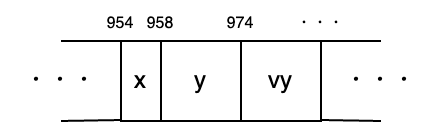
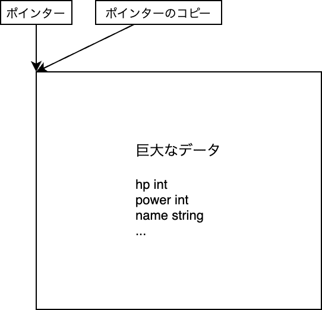

# 第十八章 指针（Pointer）


这次，我们将讨论**编程初学者的“鬼门”，指针**。我认为比起 C 语言，觉得 Go 指针难的人并不多。但仍然会有不少人害怕它，因此我会仔细地解说。

##  指针

**指针/pointer** 是一个用来**“指出某物位置”**的词，储存变量等的“位置”。用法如下所示。

```go
package main

import "fmt"

func main() {
	x := 42
	p := &x         // xのアドレスをpに代入
	fmt.Println(p)  // 0xから始まる謎の数字
	fmt.Println(*p) // 42
	*p = 99         // pが指し示す場所に99を代入
	fmt.Println(*p) // 99
	fmt.Println(x)  // 99
}
$ go run .
0x1400009a020
42
99
99
```


新出现的 `&` 和 `*` 是进行指针相关操作的符号。可能会让人感到困惑，我们来一步步看看。

## 计算机的内部结构

计算机的核心是进行计算的 **CPU（英特尔整天做广告的那玩意）**和用于存储数据的内存（8GB 或 16GB 等）。它们通常被比作人类的大脑和桌面上的工作区域。大脑越聪明，计算越快；桌面越大，工作空间越宽裕。

这张桌子上的所有数据都井然有序地排列着，每个数据都有一个表示位置的数字。这个数字就是地址/address。最初是表示“住所”的词，有时也被翻译为“番地”。


下图是这样的内存中变量 `x` `y` `vy` 被保存的样子。

!954、958、974 等地址仅仅是为了说明“存在地址这个数字”而临时指定的值，因此与实际地址的分配方式有很大不同。请注意。

 *メモリ内部のイメージ 内存内部的图像*

变量存储在内存中，内存上的数据分配了地址，如果掌握了这些，指针就可以轻松应对了。

## & 和 *

在 Go 中，如下图所示，可以通过 `&` 获取分配给变量的地址，通过 `*` 获取地址所指向的内容。


这样一来，开头的程序也一定能读懂了。

再贴一遍

```go
package main

import "fmt"

func main() {
	x := 42
	p := &x         // xのアドレスをpに代入
	fmt.Println(p)  // 0xから始まる謎の数字の正体は、xのアドレス！
	fmt.Println(*p) // 42 (指し示す先はxなので)
	*p = 99         // pが指し示すxに99を代入
	fmt.Println(*p) // 99
	fmt.Println(x)  // 99
}
```


なお， `fmt.Println(p)` で显示的 `0x` ，这是 **16 进制**的意思。平常使用的 10 进制是用 0 到 9 的数字表示一位，而 16 进制则是用 0 到 9 和 A 到 F 共 16 种表示一位。在 Go 中，16 进制的前面加上 `0x` 以区分于 10 进制。

总之只是表示法不同而已，实际上只是整数，所以完全不用担心。例如 `0x1400009a020` 转换为十进制是 `1374390165536` 。地址使用十六进制只是一个习惯，所以不必太在意。

## 指针类型

下图中还有一个地方没有解释，那就是 `p *int` 的部分。


在 Go 中，可以将地址赋值给**指针类型**。指针类型以 `*int` 的形式写作 `*型名` 。

麻烦的是， `&` 获取的地址结果的类型不是 `&int` 而是 `*int` 。不过这是历史原因造成的，只能记住。个人来说，我希望指针类型叫 `&int` 。

## 零值，nil

指针类型的零值是 **nil（空）**这个特殊值。nil 表示不指向任何地方的无效值。
nil 指向的地方在 `*` 中使用时会崩溃，所以请小心使用。

```go
func main() {
	var p *int
	*p = 42 // クラッシュ
	fmt.Println(*p)
}
```

利用 nil 的含义，也可以用来表示有无效和有效时的变量。

```go
func main() {
	p := 何らかの関数() // 返り値が無効な時と有効な時がある
	if p != nil {       // 有効な (nilではない) 時だけ処理を行う
		fmt.Println(*p)
	}
}
```

nil 不仅用于纯粹的指针类型，还用于 Go 提供的几种类型，表示空值。关于这一点我们会稍后再提。

## 结构体和指针

为了结合结构体和指针，提供了一些特殊的便利功能。

首先，在合成字面量前加上 `&` ，可以直接创建该结构体的指针，而无需通过变量。这是相当常用的。

```go
pp := &position{10, 20}
// ↑と↓は同じ意味
p := position{10, 20}
pp := &p
```

另一个，当从结构体指针使用字段时，可以像普通结构体一样写 `pp.x` 。

```go
pp := &position{10, 20}
pp.x = 30
fmt.Println(pp.x) // 30
```

如果没有这个功能，需要通过指针指向的结构体，那么在考虑 `*` 和 `.` 的优先级时，就必须写成 `(*pp).x` ，这真是一个非常感谢的功能。对于有 C 系语言经验的人来说，听到可以不必区分 `.` 和 `->` ，应该就能明白了。

## 指针的使用场合


指针大致有三个使用场景。

- 避免大数据的复制
- 中身被改写
- 无效值用 nil 表示

最后一个已经提到过了，接下来我将对前两个进行解说。

### 使用场景 1：避免大量数据的复制

当将参数传递给函数时，该参数会被复制。如果该参数非常庞大，复制将耗费时间（复制庞大数据对计算机来说是重负担）。

指针只是一个数字，因此只需复制指针，就可以相对快速地在函数中通过指针使用该数据。



### 使用场景 2：要求更改原始内容

这也是由于参数被复制而引起的事情，但在函数内部对参数这个副本进行的任何修改都不会影响原始变量。

使用指针时，复制的指针也会指向原始变量，因此即使在函数内部也可以修改原始变量。

```go
func f(x int) {
	x = 99
}

func g(p *int) {
	*p = 99 // 指し示す先 = オリジナルを書き換える
}

func main() {
	x := 42
	f(x)
	fmt.Println(x) // 42。xは書き換わらない
	g(&x)
	fmt.Println(x) // 99。xは書き換わる
}
```

猜数字游戏中出现的 `fmt.Scanln` 函数取参数为指针也是为了这个原因。

```go
x := 0
fmt.Scanln(&x) // x を書き換えてもらう
```

### 其他用途

基本是以上所述，但在实践中正确区分所有指针，即使是熟练的程序员也非常困难。因此，这次我将传授一个大致可以说是 OK 的粗略指导。虽然提到了尚未涉及的 Go 功能，但请您谅解，并将其放在脑海的一角。

**应使用指针的情况：**

- 值写入函数
-  结构体型的参数
- 切片元素的类型

**不需要使用指针的情况：**

- 数值、真值型的参数（没有将其指针化的好处）
- 文字串、切片、映射、通道、闭包、接口类型的参数（实质上是指针类型）

## 重构

那么照例，我们来试试在重构中使用指针的感觉。根据上述指导方针，这次关注的是“切片元素的类型”和“结构体类型的参数”。在 `var walls` 和 `drawWalls` 附近似乎可以使用指针。

```go
var walls = []*wall{}
func drawWalls(w *wall) {
```

那么我们来将其应用于整体。

```diff-go
package main

import (
	"embed"
	"math/rand/v2"

	"github.com/eihigh/miniten"
)

//go:embed *.png
var fsys embed.FS

type wall struct {
	wallX int
	holeY int
}

var (
	x    = 200.0
	y    = 150.0
	vy   = 0.0  // Velocity of y (速度のy成分) の略
	g    = 0.1  // Gravity (重力加速度) の略
	jump = -4.0 // ジャンプ力

	frames     = 0         // 経過フレーム数
	interval   = 120       // 壁の追加間隔
	wallStartX = 640       // 壁の初期X座標
	walls      = []*wall{} // 壁のX座標と穴のY座標
	wallWidth  = 20        // 壁の幅
	wallHeight = 360       // 壁の高さ
	holeYMax   = 150       // 穴のY座標の最大値
	holeHeight = 170       // 穴のサイズ（高さ）

	gopherWidth  = 60
	gopherHeight = 75

	scene         = "title"
	score         = 0     // スコアのグローバル変数
	isPrevClicked = false // 前のフレームでクリックされていたか
	isJustClicked = false // 今のフレームでクリックされたか
)

func main() {
	miniten.Run(draw)
}

func draw() {
	// ...省略...
}

func drawTitle() {
	// ...省略...
}

func drawGame() {
	miniten.DrawImageFS(fsys, "sky.png", 0, 0)
	for i, wall := range walls {
		if wall.wallX < int(x) {
			score = i + 1
		}
	}
	miniten.Println("Score", score)
	if miniten.IsClicked() {
		vy = jump
	}
	vy += g // 速度に加速度を足す
	y += vy // 位置に速度を足す
	miniten.DrawImageFS(fsys, "gopher.png", int(x), int(y))

	// 壁追加処理ここから
	frames += 1
	if frames%interval == 0 {
		wall := &wall{wallStartX, rand.N(holeYMax)}
		walls = append(walls, wall)
	}
	// 壁追加処理ここまで

	for i := range walls {
		walls[i].wallX -= 2 // 少しずつ左へ
	}
	for _, wall := range walls {
		wall.wallX -= 2 // 少しずつ左へ
	}
	for _, wall := range walls {
		drawWalls(wall)

		// ...省略...
	}

	if y < 0 {
		scene = "gameover"
	}
	if 360 < y {
		scene = "gameover"
	}
}

func drawGameover() {
	// 背景、gopher、壁の描画はdrawGame関数のコピペ
	miniten.DrawImageFS(fsys, "sky.png", 0, 0)
	miniten.DrawImageFS(fsys, "gopher.png", int(x), int(y))
	for _, wall := range walls {
		drawWalls(wall)
	}

	miniten.Println("Game Over")
	miniten.Println("Score", score)
	if isJustClicked {
		scene = "title"

		x = 200.0
		y = 150.0
		vy = 0.0
		frames = 0
		walls = []*wall{}
		score = 0
	}
}

func drawWalls(w *wall) {
	// 上の壁の描画
	miniten.DrawImageFS(fsys, "wall.png", w.wallX, w.holeY-wallHeight)

	// 下の壁の描画
	miniten.DrawImageFS(fsys, "wall.png", w.wallX, w.holeY+holeHeight)
}

func hitTestRects(aLeft, aTop, aRight, aBottom, bLeft, bTop, bRight, bBottom int) bool {
	return aLeft < bRight &&
		bLeft < aRight &&
		aTop < bBottom &&
		bTop < aBottom
}
```

最初提到的 `walls` 变量声明和 `drawWalls` 函数声明以外，

- 壁的附加处理（ `&wall{...}` ）
- 壁的移动处理（ `wall.wallX -= 2` ）
- 壁的重置处理（ `walls = []*wall{}` ）


对全局影响不大，意外地容易适用。


有趣的是墙壁的移动处理。 `for range` 文中提取的元素类型变成了指针，因此可以通过复制的 `wall` 指针来修改原始值，结果不再需要使用循环次数 `i` 。实际上，这种新的写法在 Go 中是常见的写法。

```diff-go
// before
	for i := range walls {
		walls[i].wallX -= 2 // 少しずつ左へ
	}
// after
	for _, wall := range walls {
		wall.wallX -= 2 // 少しずつ左へ
	}
```

## 本章总结

指针表示变量的位置。在 Go 中，使用 `&` 获取地址，使用 `*` 获取地址所指向的内容。指针用于避免大数据的复制或在函数中修改变量。

计算机的核心与其深度相关，想要正确使用即使是熟练者也会感到困难，但如果掌握基本方针，大多数情况下应该能够编写出合格的程序。
